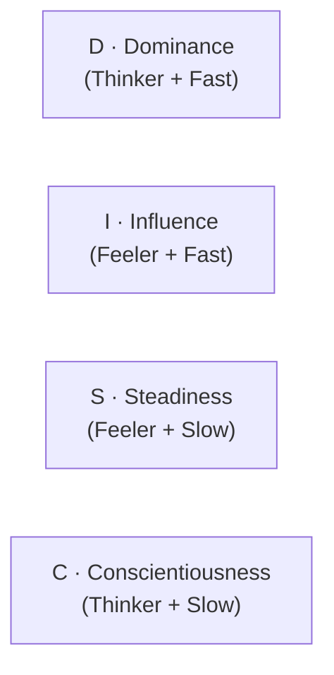
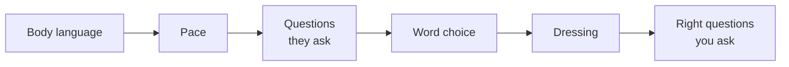

# Day 31 — DISC + 5-Minute Speed-Read

> **The one idea for today:** Stop selling the way *you* buy. And get your read in 5 minutes — because that's the window before the meeting locks its pace.

By the time you close today you'll name the 4 DISC profiles (Dominance, Influence, Steadiness, Conscientiousness) and the 2–3 traits that define each, understand the 2 axes behind DISC (**Thinker vs Feeler** and **Fast/Extrovert vs Slow/Introvert**), and self-assess your own dominant profile — because selling *your* way is the trap, and knowing your default is the first defence.

---

## Why this matters now

You've spent 5 weeks on voice, scripts, and volume. The reason the close rate still moves slowly is that every prospect is a different type of person — and you've been delivering the same voice to all of them.

DISC is the framework that tells you, in the first 2–3 minutes of a meeting, *what kind of person you're talking to*. Once you know, you can:

- **Adjust your pacing** — slow down for S, speed up for D
- **Adjust the information** — facts for C, stories for I
- **Adjust the close** — options for D, reassurance for S
- **Adjust the follow-up** — a D will tell you to get to the point; an S will need warm-up

**The objective isn't to be an amateur psychologist.** It's to match the register of the prospect in front of you, so the same good advice actually lands.

---

## The 2 axes behind DISC

The 4 profiles aren't random — they come from 2 underlying dimensions:

| | **Thinker (facts, logic)** | **Feeler (emotion, people)** |
|---|---|---|
| **Fast / Extrovert** | **D** — Dominance | **I** — Influence |
| **Slow / Introvert** | **C** — Conscientiousness | **S** — Steadiness |

Read the quadrant. If someone's quick + facts-driven, they're D. Quick + emotion-driven, they're I. Slow + emotion-driven, they're S. Slow + facts-driven, they're C.

This matters because once you know where a prospect sits on both axes, you already know a lot about how they'll buy.

---

## The 4 profiles at a glance

### D — Dominance
**Thinker + Fast.** Decisive, results-driven, impatient.
- **Strengths:** Sees the big picture. Extremely focused. Excellent at delegation. Embraces challenges. Takes ownership. Strong tenacity.
- **Weaknesses:** Impatient. Domineering. Little tolerance for incompetence. Confrontational. *My way or the highway.*
- **Famous archetypes:** The startup founder. The army officer. The Type-A executive.

### I — Influence
**Feeler + Fast.** Social, optimistic, story-driven.
- **Strengths:** Convincing. Generous. Likable. Makes friends easily. Great storyteller. Adventurous. Brings joy.
- **Weaknesses:** Emotional. Over-promise, under-deliver. Easily distracted. Self-centred. Poor time management.
- **Famous archetypes:** The salesperson. The performer. The social butterfly.

### S — Steadiness
**Feeler + Slow.** Harmonious, patient, loyal.
- **Strengths:** Easygoing. Patient. Considerate. Strong empathy. Self-sacrificing. Tolerant. Forgiving. Calm.
- **Weaknesses:** Lacks confidence. Procrastinates. Comfort zone. Follower mentality. Avoids heavy responsibility. Overly sensitive.
- **Famous archetypes:** The loyal family member. The team player. The peacemaker.

### C — Conscientiousness
**Thinker + Slow.** Analytical, precise, skeptical.
- **Strengths:** Disciplined. Logical. Responsible. Honest. Systematic. Organised. Under-promises and over-delivers.
- **Weaknesses:** Analysis paralysis. Skeptical (misses opportunities). Needs to be correct. Pessimistic. Micro-manager. Oblivious to others' emotions.
- **Famous archetypes:** The engineer. The accountant. The meticulous researcher.

---

## The 5-minute speed-read — and the 6 signals

Every meeting has a pacing window. You and the prospect are both, mostly unconsciously, calibrating: *how fast do we talk, how formal is this, how structured is the agenda?* That calibration locks in the first 5 minutes. Attempts to shift it later feel jarring — if you profiled correctly upfront, the meeting runs smoothly; if you didn't, you fight the pace for the next 55 minutes.

**The discipline: commit to a profile assessment by minute 5.** You can revise it later, but you need a working hypothesis early enough to actually *use* it.

### The 6-signal rapid scan

In those first 5 minutes, actively notice:

1. **Body language and facial expressions** — D stands up straight, walks fast; I gestures a lot; C frowns when thinking; S slouches and takes up little space.
2. **Tonality and pace** — D is fast and direct; I is animated; C is measured; S is quiet and soft.
3. **Questions they ask** — D asks bottom-line questions; I asks emotion-related questions; C asks process-related *why* questions; S asks permission-seeking questions.
4. **Choice of words** — D: *"cut to the chase"*; I: *"her story was inspiring!"*; C: *"let's look at track record"*; S: *"anything lah, can one."*
5. **Dressing** — D: red or black (power); I: bright, fashionable, colourful hair; C: blue or black (practical); S: plain, no make-up.
6. **The right questions *you* ask** — sometimes you have to probe. *"When you've made financial decisions in the past, did you research heavily first or go with gut?"* The answer tells you a lot.

### The 3-signals-commit rule

> **3 signals agreeing = commit to the profile.**

No single signal is definitive. Waiting for all 6 to align burns the pacing window. Not committing means you fight the pace for 55 minutes. 3-signal commit is the speed / accuracy sweet spot — enough to act on, easy to revise if a later signal contradicts.

Combine 3–4 signals and you'll land on the right profile ~80% of the time by the end of the first 5 minutes.

---

## The 2 fine-line distinctions you'll get wrong early

Two pairs are easy to confuse:

### D vs C — both strong-headed and insistent

Both stubborn. The difference is *why.*

- **D insists** because they want the *result* — bottom line, objective, outcome
- **C insists** because they stand on *principle* — correctness, fairness, process

Practical test: offer them a shortcut that compromises principle to hit the result. D will take it; C won't.

Secondary difference: **D needs to be in charge; C needs to be in control.** Subtle but important — D leads teams, C builds systems.

### I vs S — both emotional and empathetic

Both warm. The difference is *how they express it.*

- **I shows it** — bigger smile, more expressive, will tell you their feelings
- **S hides it** — reserved smile, doesn't volunteer emotion, you have to ask

Practical test: tell them a mildly sad story. I will react visibly and share their own similar story. S will nod quietly and maybe say *"oh… that's hard."*

---

## Your own profile — the biggest blind spot

The #1 reason advisors miss-sell is they sell the way *they* buy.

- A D-profile FC walks into every meeting assuming the prospect wants *results fast*. When the prospect is S, the pace terrifies them and they shut down.
- An I-profile FC wants to tell stories and connect emotionally. When the prospect is C, the stories feel fluffy and unserious, and the C tunes out waiting for facts.

**You are biased by your own default profile.** The first work of DISC is knowing your own — so you can consciously counter-program when the prospect isn't the same type.

Quick self-test (honest answers):
- When you buy something big, do you decide **fast or slow**?
- When you decide, do you weigh **emotion or facts** more heavily?
- In a group, are you the one **talking or the one listening**?
- Under stress, do you **take charge or defer**?

Rough mapping:
- Fast + emotion + talking + take charge = **I** (with some D)
- Fast + facts + take charge + less talking = **D**
- Slow + emotion + listening + defer = **S**
- Slow + facts + listening + take charge over detail = **C**

Most people are a dominant profile + a secondary. You'll see yours over the week.

---

## Quiz

**Q1. The 2 axes underlying DISC are:**
- A) Confidence / humility and openness / closedness
- B) Thinker vs Feeler, and Fast/Extrovert vs Slow/Introvert ✓
- C) Competence / warmth and dominance / submission
- D) Extroversion / introversion and agreeableness / disagreeableness

**Why:** D and C are both Thinkers; I and S are both Feelers. D and I are both Fast / Extroverts; S and C are both Slow / Introverts. The 4 profiles are the 4 quadrants of these two axes. Knowing the axes helps you pattern-match faster than memorising 4 separate profile cards.

**Q2. D and C are both strong-headed and insistent. The difference is:**
- A) D is male, C is female
- B) D insists on the result; C insists on the principle ✓
- C) D insists louder; C insists more quietly
- D) They're actually the same thing

**Why:** Both profiles dig in under pressure — but they dig in on different things. D cares about the *outcome* (hit the number, win the deal, move forward). C cares about the *principle* (correctness, fairness, process). A shortcut that hits the result but compromises the principle: D takes it, C refuses. This distinction matters a lot in the close — you pitch results to D and rigor to C.

**Q3. The #1 reason advisors miss-sell is:**
- A) Product knowledge gaps
- B) Weak objection handling
- C) They sell the way *they* buy, instead of the way the *prospect* buys ✓
- D) Not enough closing technique

**Why:** Every advisor has a default DISC profile, which shapes their selling style. If the prospect shares the profile, things flow naturally. If the prospect is the *opposite* profile, the advisor's default feels alien — a fast D feels pushy to an S, a story-driven I feels flighty to a C. Knowing your own default is the prerequisite to counter-programming when the prospect is different — which is what turns a 30% close rate into 50%+.

**Q4. I and S profiles are both emotional and empathetic. The practical test that distinguishes them:**
- A) I is male, S is female
- B) Tell them a mildly sad story — I reacts visibly and shares their own similar story; S nods quietly and maybe says *"oh… that's hard"* ✓
- C) I cries more easily
- D) S never shares emotion

**Why:** Both are Feelers (same axis). The difference is *expressiveness*. I *shows* it — bigger smile, more expressive, volunteers feelings. S *hides* it — reserved smile, doesn't volunteer, you have to ask. Same emotion underneath, different external channel. A mildly sad story surfaces the expressiveness gap immediately — I reciprocates out loud; S holds it quieter.

**Q5. One signal you're with a D in the first 5 minutes:**
- A) They laugh at your first joke
- B) They ask *"what's the bottom line?"* or *"what do I need to decide today?"* within the first 2 minutes ✓
- C) They sit quietly with arms crossed
- D) They take detailed notes

**Why:** D's announce themselves with bottom-line questions fast. I's laugh and tell stories (A). S's sit quietly (C). C's take detailed notes (D). Each profile has a signature opening move — the D's is *"let's cut to it"* in one form or another, usually within the first 2 minutes. That question alone is enough to flip you into D-mode.

**Q6. A C-profile prospect asks *"what if [specific edge case]?"*. The correct move is:**
- A) *"That's unlikely to happen"*
- B) Walk them through exactly what happens in that scenario, with the policy document open; if you don't know, *"I'll email the exact clause by Monday"* and deliver ✓
- C) Dismiss the question as overthinking
- D) Answer vaguely to keep momentum

**Why:** C's love edge cases — not to trap you, but because they genuinely want to understand the downside. Dismissing the question damages trust. The correct move is precision: answer with the clause, or honestly defer with a specific delivery date. Delivering the promised email by Monday is exactly what *earns* the C's trust. Vague answers (D) are what loses them.

**Q7. If you're a fast-paced D yourself and the prospect is an S, what's your first-move adjustment?**
- A) Speed up to show expertise
- B) Slow your pace by ~20%, leave silence after their answers, and don't rush to the next question ✓
- C) Pivot to a C-profile approach
- D) Hand the meeting to a colleague

**Why:** Matching pace is the most load-bearing adjustment across profiles. A D-paced delivery to an S feels like pressure; an S doesn't need more information, they need more *permission*. Slowing down by 15–20%, extending pauses, and giving them time to think is what makes the S feel safe enough to actually engage. This counter-programming is exactly the Week 7 training ground.

---

## Related

- Previous: [[../week-5/day-30|Day 30 — Practice: 10 Asks, 3 Referrals]]
- Next: [[day-32|Day 32 — D Profile: Direct, Dominant, Decisive]]
- Week 6 overview: [[README|Week 6 — Reading People: DISC Complete]]
