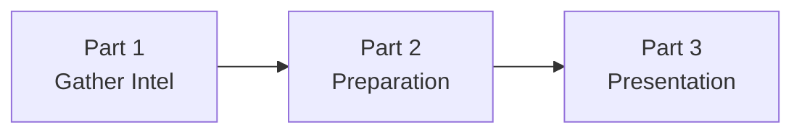
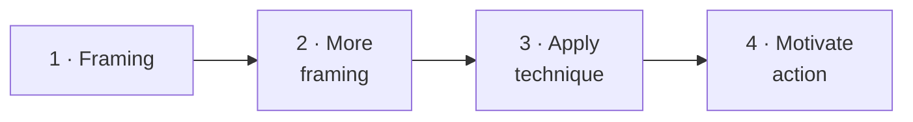

# Day 39 — Pain-Before-Gain Framing

> **The one idea for today:** Loss aversion is ~2× stronger than gain orientation. Showing what they'd lose moves more people than showing what they'd gain.

By the time you close today you'll run the 3-part framework (Gather Intel → Preparation → Presentation) on every hot-button-driven pitch, use the 4-step execution inside the Presentation (Framing → More Framing → Technique → Motivate to Action), and apply visualisation ethically — *"Imagine if…"* questions that make the stakes real without manufacturing fear.

---

## Why pain-before-gain works

The loss aversion principle: **people hate losing $100 about twice as much as they love gaining $100.**

Applied to financial planning: a pitch that frames *"here's what you gain"* activates weaker buying circuitry than *"here's what you stand to lose without this."* Both can work, but the second is substantially stronger for most prospects, especially S's and C's who lean risk-averse by default.

**The ethical rule (restated):** only paint a loss that's *real.* If the gap in their coverage means real exposure, surface it. Don't invent scenarios where the gap isn't actually there.

---

## The 3-part framework for every hot-button pitch

### Part 1 — Gather Intel
The Fact-Find + Day-38 questioning work. Goal: surface 2–3 hot buttons, identify which is hottest, capture everything.

Mental markers:
- Which hot buttons surfaced loudest?
- Which product elements obviously address those hot buttons?
- Which hot button is *live right now* vs which is latent?

### Part 2 — Preparation
**Between the Fact-Find and the Presentation** (usually a day or two), you:

- **Create the angle** — how to position your recommendation so it smoothly hits the hot buttons identified
- **Align product benefits to hot buttons** — specific elements → specific concerns (mapping from Day 38)
- **Anticipate objections** — what will this prospect likely push back on? Pre-prepare responses

The best advisors spend 30–60 minutes on Preparation between meetings. New FCs often skip this and wing the presentation — which is why their close rate plateaus.

### Part 3 — Presentation
Deliver the pitch with hot-button activation built in. The next section is the 4-step execution inside the presentation.

---

## The 4-step execution (inside Part 3)

### Step 1 — Framing
Set the frame for what the presentation is going to do. *"Today I'll walk you through what I've put together based on what you shared. I'll start with your biggest gap, then the recommendation, then we'll look at alternatives."*

### Step 2 — More framing
Re-anchor the hot buttons before you get into product. *"Remember at the start you said the thing that worried you most was [X]? That's what I've built the plan around."*

### Step 3 — Apply the technique
The hot-button-activation move. **Visualisation** (see Section 4).

### Step 4 — Motivate to action
Convert the emotional activation into a commitment. Close technique from Day 41 (Pitch Mechanics) — Assumptive, Procedural, Reassurance, or Follow-up — matched to their profile.

---

## The Visualisation technique

The single most powerful technique inside Step 3. Two formats:

### Format A — Future projection
> *"Imagine if — 20 years from now — [concrete scenario involving their hot button]. What does that look like for your family?"*

Example:
> *"Imagine 20 years from now. You're 58. Your daughter's starting her career. Your son's in his final year of uni. Something happens — a serious CI event. What does the next 5 years look like in your current setup?"*

20 seconds of silence. They picture it. The silence is where the hot button fires.

### Format B — Past callback
> *"Remember when you told me about your dad's stroke? Picture that, but it's you. Your wife is in the position your mum was in. What would that stretch look like for her?"*

More direct. Stronger impact. Use carefully — only if the prospect surfaced that specific example themselves, and only if you have the rapport to go there.

### Making them the subject of the story
Both formats put the *prospect* as the protagonist. The hot button fires strongest when they picture themselves — not a hypothetical third party, not a statistic, not *"most people"*. Them.

---

## The ethical line on visualisation

Two rules:

### Rule 1 — The scenario must be plausible
Visualise futures that could genuinely happen to this prospect. A 38-year-old smoker has a legitimate risk of CI; visualising it is fair. A 28-year-old ultra-fit triathlete has a statistically much lower CI risk at this stage; leading with dramatic CI visualisation for them is manufactured, not surfaced.

### Rule 2 — You address with a real solution
If you paint the loss, your solution must *actually address it.* Visualising a CI scenario and then recommending a generic term-life policy that doesn't cover CI is bait-and-switch. The visualised pain must map to a product element that genuinely solves it.

If you can't meet both rules, don't visualise. Switch to gain-oriented framing, or surface a different hot button.

---

## Pain-before-gain examples by hot-button category

Different hot buttons respond to different visualisation formats:

### Loved ones — "your kids in year 5 post-event"
> *"Picture your son at 15 — 5 years after your CI event. The medical bills are resolved. What's different about how he's growing up?"*

### Dreams / Goals — "the retirement you wanted vs the one you'd get"
> *"You said you wanted to retire at 58 to travel. Picture that with the current plan. Now picture if a health event in year 3 of retirement forces you to draw down faster than planned. Where does that leave you at 68?"*

**Pre-retiree variant — concrete CPF math version.** When the prospect is 53–58 and you've established CPF balances in Fact-Find, the visualisation can be quantitative — which lands harder than the abstract version above for analytical prospects:

> *"You said you'd want to take $100K out of your CPF excess at 55 to help your son with his property deposit. Here's the math: $100K out today = roughly **$112K less in your retirement stack at 60**. The $12K is the foregone interest. Picture you and your wife at 65 — five years into the retirement we just planned — and that $12K shortfall is what makes the difference between the trip you wanted and the trip you settle for."*

The specific numbers (drawn from the Albert Seah retirement-cashflow planner, Miss Singer case) make the trade-off real. Vague "you'd lose some interest" doesn't activate loss aversion. *"$12K is the difference between the trip you wanted and the trip you settle for"* does. Always ground the visualisation in their actual situation, not a hypothetical.

### Bad Experiences / Fear — direct callback
> *"The thing your parents went through when your dad got sick — imagine that, but it's Ruth in your mum's position. With CI coverage at $500K, here's how the next 2 years look. Without it…"*

### Needs vs Reality — the gap made concrete
> *"You said you have $30K in emergency funds. A CI event with no coverage typically runs $150–$250K out of pocket in the first 24 months. Let me walk you through what happens to the $30K in month 4."*

Each visualisation matches a specific hot button category. Generic *"imagine the worst"* doesn't work nearly as well as *imagine the worst specifically tied to the thing you said matters most.*

---

## Motivating to action — the bridge from emotion to commitment

After visualisation, you've activated the emotion. The prospect is quiet, thinking. Now you bridge to action.

> *"[After visualisation sits]… That's why I'm recommending we move on this. Not because of the fear — because what we can do today is remove the 'what if' from that picture. Should we set it up?"*

Three elements:
1. **Acknowledge the moment** — *"that's why…"*
2. **Reframe from fear to agency** — *"what we can do today is remove the 'what if'"*
3. **Direct ask** — *"should we set it up?"*

The reframe from *fear* to *agency* is what keeps the technique ethical. You're not leaving the prospect in the pain of the visualisation. You're giving them a way to solve it.

---

## Quiz

**Q1. The 3-part hot-button framework runs:**
- A) Presentation → Preparation → Intel
- B) Gather Intel → Preparation → Presentation ✓
- C) Discovery → Demo → Close
- D) Warm up → Pitch → Close

**Why:** Intel (Fact-Find questioning, Day 38) surfaces hot buttons. Preparation (between meetings) maps hot buttons to product elements. Presentation (delivery) activates the emotion and converts to commitment. Skipping Preparation — the middle step — is where most new FCs lose close rate. Winging the presentation means the hot button surfaces but the product callback doesn't land with specificity.

**Q2. The Visualisation technique works because:**
- A) It's dramatic
- B) It puts the prospect as subject of a concrete future scenario tied to their hot button — which activates the emotional decision-making circuitry ✓
- C) It shows off your knowledge of their situation
- D) It fills awkward silences

**Why:** Generic visualisations (*"imagine something bad happens"*) don't work. Visualisations tied to *the specific hot button they surfaced* and *with them as the protagonist* do. The silence after the visualisation is the emotional activation moment. Breaking the silence too quickly (talking over it) or visualising something too generic (un-tied to their hot buttons) both kill the technique.

**Q3. The ethical line on Visualisation is:**
- A) Don't use it at all
- B) Only visualise plausible scenarios, and your solution must actually address the loss you painted ✓
- C) Use it only on existing clients
- D) Always end on a positive note

**Why:** Manufactured scenarios (painting losses that aren't realistic for this prospect) or bait-and-switch (visualising a loss your product doesn't actually solve) crosses from ethical activation into manipulation. The two rules — plausible + genuinely solved — keep the sword pointing at real problems rather than wounding the prospect into agreement. Breaking either rule damages trust and is, simply, the wrong thing to do.

**Q4. The loss-aversion principle says:**
- A) People love gains equally to losses
- B) People hate losing $100 roughly twice as much as they love gaining $100 ✓
- C) Gains always outweigh losses
- D) Only older people care about losses

**Why:** This ~2:1 ratio comes from decades of behavioural-economics research. Applied to pitches: framing what the prospect stands to lose activates stronger buying circuitry than framing what they stand to gain. This is why pain-before-gain works — not manipulation, just matching the brain's actual weighting. The ethical constraint is that the loss you paint must be real.

**Q5. In the 3-part framework (Gather Intel → Preparation → Presentation), which step do most new FCs skip?**
- A) Gather Intel — they don't ask questions
- B) Preparation — they wing the presentation without mapping hot buttons to product elements between meetings ✓
- C) Presentation — they don't deliver
- D) None — they do all three equally

**Why:** Preparation is the invisible middle step. Most FCs Fact-Find (Gather) and then show up to pitch (Present) without spending 30–60 minutes in between mapping what the prospect said to specific product elements, pre-planning callbacks, and anticipating objections. Skipping it produces pitches that flow but don't land — because the callbacks aren't specific and the recommendation doesn't feel custom-built.

**Q6. The Visualisation puts the prospect as subject (not a hypothetical third party) because:**
- A) It's more dramatic
- B) Hot buttons fire strongest when the prospect pictures themselves in the scenario — statistics and "most people" abstractions activate weaker circuitry ✓
- C) It fills airtime
- D) It's required by compliance

**Why:** *"Imagine if something happens to 1 in 10 Singaporeans"* doesn't activate a hot button. *"Imagine 20 years from now. You're 58. Your daughter's starting her career. Your son's in his final year of uni. Something happens…"* puts the prospect as protagonist in a specific future. Their brain fills in their actual daughter, actual son, actual situation — which is what fires the emotional circuitry. Generic statistics bounce off; personal pictures land.

**Q7. The "bridge from emotion to commitment" after a Visualisation has 3 elements:**
- A) Product features + price + close
- B) Acknowledge the moment, reframe from fear to agency ("what we can do today is remove the 'what if'"), direct ask ✓
- C) Silence, silence, silence
- D) Tell another story

**Why:** After activation, leaving the prospect in fear is unethical and kills the close (they feel manipulated). The bridge honours the moment (*"that's why…"*), reframes to action they can take (*"what we can do today is remove the 'what if'"*), then directly asks (*"should we set it up?"*). Turning fear into agency is the ethical move AND the close move — same line does both. Without the reframe, the pitch lands as scare-then-sell; with it, lands as name-the-problem-then-solve.

---

## Related

- Previous: [[day-38|Day 38 — Hot Buttons II]]
- Next: [[day-40|Day 40 — Objection Turnaround]]
- Week 7 overview: [[README|Week 7 — Hot Buttons + Pitch Mechanics]]
