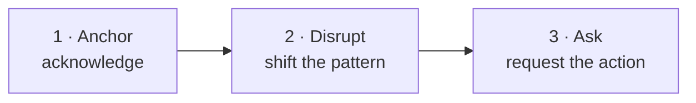
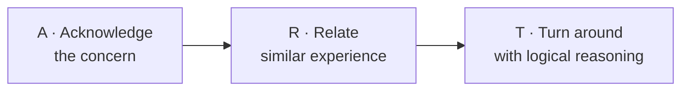
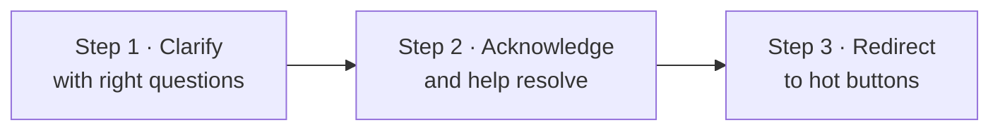
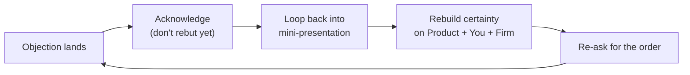

# Day 40 — Objection Turnaround

> **The one idea for today:** Objections are not rejections — they're requests for more information or reassurance. Three tools handle 90% of what prospects throw at you.

By the time you close today you'll run the Anchor-Disrupt-Ask framework on any reflex objection in under 15 seconds, tell apart a clear objection (use ART) from an ambiguous one (use Iceberg) so you don't waste energy on the wrong tool, and diagnose *"I need to think about it"* into its 4 possible meanings — then route to the right response.

---

## The three objection classes

Objections come in three shapes. Each uses a different tool:

| Class | Example | Tool |
|---|---|---|
| **Reflex / brush-off** (first 30 sec of a call or opener) | *"I'm busy."* *"Not interested."* *"Send me an email."* | **Anchor-Disrupt-Ask** |
| **Clear objection** (explicit reasoning stated) | *"Too expensive."* *"Comparing with NTUC — theirs is cheaper."* | **ART** |
| **Ambiguous objection** (vague / could mean multiple things) | *"Let me think about it."* *"I'm not sure."* | **Iceberg** |

Using the wrong tool wastes the moment. Anchor-Disrupt-Ask on a C who just asked a precise question makes you sound like a cold-caller. ART on *"let me think"* tries to argue a ghost — you haven't surfaced what they're actually objecting to.

---

## Anchor-Disrupt-Ask — the fast turnaround

A 3-beat framework for brush-offs and reflex objections. Under 15 seconds, start to finish.

| Beat | What it does | How it sounds |
|---|---|---|
| **A · Anchor** | Acknowledge their objection — you heard them | *"That is exactly why I called."* *"Got it."* *"Completely understand."* |
| **D · Disrupt** | Break the pattern they expect | *"I figured you would be, which is why I'm asking for 4 minutes, not 30."* *"Most of my clients said the same before we met."* |
| **A · Ask** | Direct ask for the thing you want | *"How about Tuesday 2pm for a 15-min call?"* *"Can we book the Fact-Find for next Thursday?"* |

**Worked examples:**

> **Prospect:** *"I'm busy."*
> **You:** *"That's exactly why I called [anchor]. I figured you would be, so I want to find a time more convenient [disrupt]. How about Wednesday 3pm? [ask]"*

> **Prospect:** *"Not interested."*
> **You:** *"Completely understand [anchor]. Most people say that before they've seen what I actually do — I'd be surprised if you weren't cautious [disrupt]. Can I send you a 2-minute video that answers 90% of questions, and we talk next week if any of it lands? [ask]"*

> **Prospect:** *"Just email me the details."*
> **You:** *"Will do [anchor]. One thing though — the 'email the details' version is pretty generic, and it usually sends you back with more questions [disrupt]. Want me to book 10 minutes so I can tailor it to your situation first? [ask]"*

**Write and rehearse these scripts.** Scripts create authenticity in the moment, not artificiality — because the structure frees you to listen rather than scramble for words.

---

## ART — for clear objections

When an objection is **commonly heard, stated explicitly, and has specific reasoning**, use **ART**:

**Worked example:**

*Prospect:* *"I'm comparing your plan with NTUC — theirs is government-related with lower premium."*

**A · Acknowledge (empathy):**
> *"I completely understand why you're comparing — who wouldn't want to make sure they're making the best decision?"*

**R · Relate (similar experience):**
> *"Most of my clients did the same — compared 3–4 providers, ran thorough research."*

**T · Turn around (question back, not lecture):**
> *"But wouldn't you wonder — after all that comparison, why most of them eventually chose this one? There must be a reason, right? What do you think it could be?"*

**The question back is what makes ART work.** You're not pitching; you're inviting them to reason through why comparison-shoppers still converge.

Other clear-objection examples where ART fits:
- *"It's too expensive."*
- *"We should compare with other providers."*
- *"I already have coverage through my employer."*
- *"Premium inflation is too high right now."*

---

## Iceberg — for ambiguous objections

When an objection is **ambiguous** and could mean multiple things (classic: *"let me think about it"*), use the **Iceberg Theory**:

**Step 1 — Clarify with right questions.** *Is it the premium? Is it the commitment? Is it needing to talk to someone? Is it a hidden concern?* Surface the real issue before trying to solve it.

**Step 2 — Acknowledge and help resolve the actual concern** (not the surface phrase).

**Step 3 — Redirect back to the hot buttons** (Days 37–39) that drove interest in the first place.

The rule: **ART handles objections where the real concern is stated explicitly. Iceberg handles objections where the real concern is *hidden below the surface* — *"think about it"* rarely means they want to analyse.**

---

## When the objection keeps moving — looping

You rebut *"too expensive"* cleanly. The prospect nods, says *"makes sense"*, then immediately hits you with *"I need to speak to my wife."* You handle that. Then: *"Actually, maybe I'll compare a bit more."* Then: *"Timing's bad — let me circle back next month."*

Every objection got a clean rebuttal. You still didn't close. Why?

**Because the stated objection was never the real problem.** Objections are smoke screens for **uncertainty**. If the prospect is uncertain about the product, uncertain about you, or uncertain about the company, they will keep generating new objections until one of them sticks — because the underlying uncertainty hasn't moved.

### The Three Certainties

Before a prospect can buy, three things must all sit at a 9 or 10 on their internal certainty scale:

| # | What they must be certain of | What lowers this |
|---|---|---|
| **1** | **The product is right for them** | Weak pitch, vague benefits, wrong angle |
| **2** | **You are trustworthy and competent** | Poor rapport, scripted delivery, no active listening |
| **3** | **The company behind the product is reliable** | No social proof, no firm story, no claims history shared |

If even one of these sits at a 5 or below, you can rebut every objection perfectly and still not close.

### Looping — the uncertainty-rebuilder

When rebuttals aren't moving the sale, stop rebutting and **loop** back into presentation mode. Rebuild certainty on all three before asking for the order again.

**A looping script template:**

> *"I completely hear you on [objection]. Let me take a step back for a second — because I want to make sure this is actually the right fit for you, and not just a product I'm pushing. So the reason I believe this makes sense for you is [product angle, tailored to their hot button]. Based on everything you shared earlier, [connect to their specific situation — builds certainty #1]. And look — I'm not going to be the advisor who shows up once and disappears. What I do differently is [your service commitment — builds certainty #2]. The firm itself has [claims record / size / history — builds certainty #3]. So — with all that, does the path forward feel clearer now?"*

**The rule of three loops:** loop at most three times on any single call. If after three loops you're still generating objections, the prospect's action threshold is too high for this session — **schedule a follow-up, don't grind**. You're protecting the relationship.

### When to use looping vs. ART vs. Iceberg

| Situation | Tool |
|---|---|
| First time the objection appears, specific and clear | **ART** |
| First time the objection appears, vague ("let me think") | **Iceberg** |
| The prospect keeps generating new objections after clean rebuttals | **Looping** |
| Brush-off in the first 30 seconds | **Anchor-Disrupt-Ask** |

Looping is the tool you reach for when the first three have been tried and the sale is drifting. It's the "what's actually going on here?" move.

---

## *"I need to think about it"* — the 4 meanings

Most common ambiguous objection. Usually one of 4 things:

1. **Profile habit** — C profiles overthink by default; S profiles are afraid to commit
2. **Don't see the need** — you haven't established enough pain
3. **Need to discuss with someone** — usually spouse or parents
4. **Hidden concern you haven't addressed** — unnamed gap in your pitch

**Step 1 in Iceberg is distinguishing which.** Questions to surface the real meaning:

- *"If I may ask — is there something specific holding you back? The monthly amount, the commitment length, or something about the plan itself?"*
- *"Am I right to say you're pretty satisfied with this plan, and it's more a habit of sitting on decisions for a day or two?"*
- *"Is it something you need to discuss with someone at home first?"*

The answers route you to different responses. **Diagnosing first, responding second**, is the Iceberg discipline.

---

## The S / C combo — *"I need to think"* for profile reasons

Two of the four DISC profiles almost always ask for time before deciding:

- **C profile** — needs to research, compare, verify. Genuine analytical need.
- **S profile** — afraid to commit, wants harmony, needs assurance.

For these profiles, *"think about it"* is often *profile habit* rather than hidden objection. Response:

**For C:** offer the data they need to complete analysis. *"Here's the comparison table, here's the spreadsheet, let's meet Thursday to finalise."* Don't pressure — facilitate.

**For S:** soften and assure. *"No rush at all — what would feeling ready look like for you? Let's set a follow-up so you don't have to carry this decision alone."*

Neither profile responds well to *"why not decide today?"* — for opposite reasons. C hears it as sloppy. S hears it as pressure. Both disengage.

---

## Quiz

**Q1. Anchor-Disrupt-Ask is best used for:**
- A) Long technical objections
- B) Reflex / brush-off objections in the first 30 seconds of a call or opener — *"I'm busy"*, *"not interested"*, *"just email me"* ✓
- C) Post-pitch objections about price
- D) Ambiguous *"let me think"* situations

**Why:** Anchor-Disrupt-Ask is a fast-turnaround tool for reflex responses — the 3 beats land in under 15 seconds, which is exactly the window you have before the brush-off becomes a hang-up. Clear objections (C) use ART; ambiguous objections (D) use Iceberg. Each tool matches a specific objection class.

**Q2. In ART, the "T" (Turn around) step ends with:**
- A) A direct statement of why the prospect is wrong
- B) A question back — *"wouldn't you wonder why most of them eventually chose [X]? There must be a reason"* — inviting the prospect to reason through it ✓
- C) A price drop
- D) Silence

**Why:** The T beat hands reasoning back to the prospect instead of lecturing them. *"Wouldn't you wonder why…"* activates their own curiosity. Direct contradiction (A) triggers resistance. Price moves (C) change the frame entirely. The question-back is what keeps ART collaborative rather than adversarial.

**Q3. *"I need to think about it"* is the classic ambiguous objection because it could mean:**
- A) Only that the price is too high
- B) 4+ different things — profile habit, no perceived need, needs to discuss, hidden concern ✓
- C) The prospect wasn't listening
- D) The deal is dead

**Why:** *"Think about it"* is the deflection phrase prospects use when they don't know how to say the specific thing bothering them (or when they're stalling per profile habit). You can't respond usefully until you've diagnosed which of the 4 is actually happening — that's Step 1 of Iceberg. Skipping diagnosis and launching into a pitch response wastes energy on the wrong problem.

**Q4. C and S profiles both often ask for time before deciding, but for opposite reasons. The correct responses are:**
- A) Both get the same response — *"sign today"*
- B) C gets pressure; S gets facts
- C) C gets the data they need to complete analysis (*"here's the comparison table — let's meet Thursday"*); S gets soft assurance (*"what would feeling ready look like? Let's set a follow-up"*) ✓
- D) Both get the same follow-up date with no tailoring

**Why:** C's delay because they genuinely need research time — offering the comparison data + a structured follow-up facilitates their process. S's delay because of fear of commitment — offering assurance and a specific follow-up honours their pace. Giving a C soft assurance feels wishy-washy; giving an S hard data can feel cold. Tailoring matches the underlying cause of the delay.

**Q5. *"I'm comparing your plan with NTUC — theirs is cheaper"* is best handled with:**
- A) Iceberg (ambiguous)
- B) ART (clear, common, specific) ✓
- C) Silence
- D) Immediate price match

**Why:** This objection is stated explicitly with specific reasoning (price + named competitor). ART handles this cleanly: acknowledge (*"I understand why you're comparing"*), relate (*"most clients compare 3–4 providers"*), turn-around (*"why do you think so many end up choosing this one?"*). Iceberg is overkill — no hidden issue to surface. Silence (C) loses the moment. Price match (D) gives up the high ground.

**Q6. The Disrupt beat in Anchor-Disrupt-Ask does what?**
- A) Contradicts the prospect directly
- B) Breaks the pattern the prospect expects — *"I figured you would be, which is why I'm only asking for 4 minutes"* ✓
- C) Repeats their objection back to them
- D) Changes the topic

**Why:** Brush-offs run on script — prospects expect salespeople to either argue or give up. The Disrupt beat does neither. It acknowledges the objection (via Anchor), then introduces an unexpected frame (*"that's exactly why"* / *"most clients said the same"* / *"I expected this"*) that breaks the prospect's auto-response. With the pattern broken, the Ask that follows has a chance to land.

**Q7. *"Let me think about it"* from an I-profile prospect most likely means:**
- A) They need to run the numbers
- B) They feel unsure and want to not-commit right now — rarely a rational analysis ✓
- C) They want to consult a spreadsheet
- D) They're testing you

**Why:** I's buy on feel. *"Let me think"* from an I almost never means *"let me run the numbers"* — that'd be a C response. It usually means they feel unsure and want to stall. The fix is an emotional check-in (*"what's feeling off?"*) rather than more data. If the emotional issue surfaces, you handle it. If they can't name one, it's feel-good decay — reschedule for 48–72 hours out before it evaporates entirely.

**Q8. A prospect hits you with *"too expensive"*, then *"need to speak to my wife"*, then *"maybe compare some more"*, then *"bad timing"* — each one after a clean rebuttal. The correct diagnosis is:**
- A) Four separate objections — rebut each one in turn
- B) The stated objections are smoke screens; underlying uncertainty on one or more of the three certainties (product / you / firm) hasn't moved — stop rebutting and loop back into presentation mode to rebuild certainty ✓
- C) The prospect is wasting your time — end the meeting
- D) Lower the price

**Why:** When objections keep moving, the real problem is never the stated objection — it's uncertainty that hasn't been addressed. Rebutting objection after objection is whack-a-mole: a new one will always appear until the underlying certainty gap is closed. Looping rebuilds certainty on Product + You + Firm before re-asking. Ending the meeting (C) abandons recoverable pipeline. Dropping price (D) rewards stalling and breaks your margin.

**Q9. The rule of three loops says:**
- A) Loop forever until they close
- B) Loop at most three times per call; if objections keep coming, schedule a follow-up rather than grind — protect the relationship ✓
- C) Loop once, then escalate to your manager
- D) Never loop more than once

**Why:** Looping is a powerful tool but has diminishing returns. Three loops is typically enough to either close or surface that the prospect's action threshold is too high for today. Past three, you're grinding — which burns trust and damages the long-term relationship. Scheduling a follow-up preserves the pipeline and lets their certainty build between sessions. Looping forever or escalating after one loop both miss the right threshold.

---

## Related

- Previous: [[day-39|Day 39 — Hot Buttons III]]
- Next: [[day-41|Day 41 — Pitch Mechanics: Confidence + Closing]]
- Week 7 overview: [[README|Week 7 — Hot Buttons + Pitch Mechanics]]
