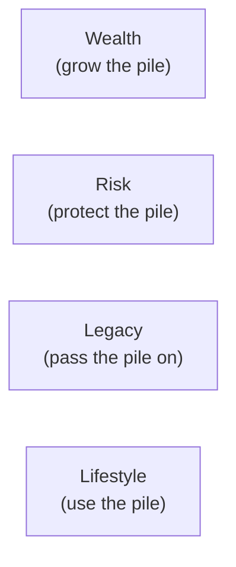

# Day 45 — The 4 Sales Angles

> **The one idea for today:** Four angles cover almost every prospect's motivation. Pick the one that fits what they actually care about — and the pitch writes itself.

By the time you close today you'll name the 4 sales angles (Wealth, Risk, Legacy, Lifestyle) and what each prospect type responds to, match any prospect to 1 primary angle + 1 secondary angle based on their hot buttons and life stage, and frame the same AIA product through 4 different angles depending on who you're talking to.

---

## Why angles matter

Same product. Same client demographics. Same price. Two FCs pitch the same plan — one closes, one doesn't.

The difference is often the *angle* — the motivational frame the pitch hung from.

A retirement plan can be pitched as:
- **Wealth** — *"this compounds at 6% annualised over 25 years, giving you $1.8M at retirement"*
- **Risk** — *"this protects you from outliving your savings — the payout continues no matter how long you live"*
- **Legacy** — *"when you're gone, the remaining balance passes to your kids tax-free"*
- **Lifestyle** — *"this funds the 3-month Europe trip with your wife you've been talking about for 5 years"*

All four are true. Only *one* activates the specific prospect in front of you. Matching the angle to the prospect is the single highest-leverage adjustment in pitch construction.

---

## The 4 angles side by side

| Angle | Core motivator | Prospect archetype |
|---|---|---|
| **Wealth** | Accumulation, growth, compounding | Young professional, entrepreneur, analytical saver |
| **Risk** | Protection, peace of mind, worst-case safety | New parents, sole breadwinners, health-conscious |
| **Legacy** | Passing on, family continuity, heirs | HNW, older clients, family-oriented |
| **Lifestyle** | Experiences, quality of life, specific dreams | Mid-career, goal-driven, experience-over-things |

Most prospects have a **primary angle** (the #1 motivator) and a **secondary angle** (the supporting motivator). The pitch leads with primary, reinforces with secondary.

---

## Angle 1 — Wealth

**Core pitch language:**
- *"Compound at X% annualised over Y years gets you to $Z."*
- *"The math works — every $1 you put in becomes $3.50 in 25 years."*
- *"Here's the growth curve. Here's the break-even point. Here's the 10-year, 20-year, 30-year outcome."*

**Who it fits:**
- Young professionals with high income, no dependants
- Entrepreneurs comfortable with numbers
- Analytical savers (often C profile)
- Anyone who thinks in multiples and returns

**Hot-button signals:**
- They ask *"what's the expected return?"* early
- They pull out a calculator or run the math in their head
- They compare your number to a specific benchmark (STI, S&P, fixed deposit rate)
- They say things like *"efficient," "compounding," "optimised"*

**AIA products that lead with Wealth:**
- Pro Achiever Elite (ILP-based accumulation)
- Platinum Wealth Venture (HNW wealth building)
- Elite Adventurer (growth-oriented ILP)

**Pitch opener (Wealth):**
> *"Let me show you the math. If we put $500/month into this structure for 25 years, here's what happens year by year. At 7% net of fees, you're at $380K by year 25. The interesting thing isn't the 25-year number — it's what happens from year 15 to year 25, when compounding actually kicks in. Watch this curve."*

---

## Angle 2 — Risk

**Core pitch language:**
- *"Here's what happens without this coverage."*
- *"Imagine the worst-case scenario — here's how this plan responds."*
- *"This is the floor. No matter what happens, this is the minimum outcome for your family."*

**Who it fits:**
- New parents
- Sole breadwinners
- People with sick parents or siblings who've seen what under-insurance looks like
- S profiles (safety-first default)

**Hot-button signals:**
- They mention a family member's health event or financial stress
- They talk about *"peace of mind,"* *"sleeping better,"* *"not worrying"*
- They ask about claim scenarios, payout timelines, worst-case numbers
- They have young kids and lean forward when you mention protection

**AIA products that lead with Risk:**
- AIA Beyond Critical Care
- AIA Diamond Heritage / Absolute Critical Cover
- AIA Pro Lifetime Protector II
- AIA HealthShield Gold Max (IP shield)

**Pitch opener (Risk):**
> *"Let's start with the worst case. If you were diagnosed with a serious CI in the next 3 years, here's what your family's financial situation would look like under your current setup — and what it looks like with the coverage we're discussing. This isn't a fear pitch. It's just the arithmetic of two scenarios, side by side."*

---

## Angle 3 — Legacy

**Core pitch language:**
- *"When you're gone, here's what passes to your kids / spouse / heirs."*
- *"This is about the generation after yours."*
- *"The plan has to outlive you — let's make sure it does."*

**Who it fits:**
- HNW clients
- Older parents / grandparents
- Business owners with family succession concerns
- Anyone with family-oriented values at the surface of every answer

**Hot-button signals:**
- They talk about *"my kids,"* *"what happens when I'm not here,"* *"my estate"*
- They mention property, business, or concentrated assets that need structuring
- They're past 45–50 with financial stability already in place
- They ask about trusts, beneficiaries, tax implications of death

**AIA products that lead with Legacy:**
- Platinum Indexed Legacy
- Pro Lifetime Protector II (permanent life with cash value)
- Whole-life structures with large face values

**Pitch opener (Legacy):**
> *"When we started this conversation, you mentioned your two kids. What I want to show you is what this plan does when you're 80 vs when you pass. Two different moments, two different uses. Let's look at the second one first — because that's the one most advisors skip."*

---

## Angle 4 — Lifestyle

**Core pitch language:**
- *"This funds [specific experience they mentioned]."*
- *"Here's the payment structure for the specific thing you want to do."*
- *"The plan exists to enable the life — not the other way around."*

**Who it fits:**
- Mid-career professionals with specific goals
- Experience-over-things people
- Prospects who mentioned a specific dream (Europe trip, early retirement, a second home, a sabbatical)
- I profiles — they buy on the *feel* of the lifestyle

**Hot-button signals:**
- They mention a specific experience or goal unprompted
- They light up when talking about *what they'd do* if money weren't a constraint
- They have disposable income but aren't optimising for accumulation
- They care more about *what they'll do with the money* than what the money does

**AIA products that lead with Lifestyle:**
- Platinum Retirement Elite (retirement income structured around lifestyle needs)
- Elite Adventurer (mid-career wealth with flexibility)
- Annuity-style products that fund specific outcomes

**Pitch opener (Lifestyle):**
> *"You mentioned earlier you'd love to do that 3-month trip around Europe with your wife — and you've been saying 'next year' for 5 years. Here's what I want to show you. This isn't about retirement in general. It's about the specific trip. Let me show you the $X/month that gets you on that plane within the next 2 years."*

---

## The primary + secondary angle pattern

Most prospects have 1 primary + 1 secondary angle. Lead with primary, reinforce with secondary.

**Examples:**

| Prospect | Primary | Secondary | Pitch shape |
|---|---|---|---|
| New parent, 34, young kids | Risk | Legacy | Lead with protection against worst case; tail with *"and this also sets up the kids' education fund"* |
| Young HNW professional, 29 | Wealth | Lifestyle | Lead with compounding math; tail with *"and here's what that enables at 40"* |
| Older parent, 55, stable career | Legacy | Risk | Lead with what passes to heirs; tail with *"and along the way it protects your retirement income"* |
| Mid-career goal-driven, 42 | Lifestyle | Wealth | Lead with the specific dream; tail with *"and the underlying accumulation math supports it"* |

**The skill:** identify primary + secondary from the Fact-Find, then structure the pitch so primary is the frame and secondary is the reinforcement. A pitch that hits both angles feels *complete* to the prospect — addressing their main motivation and their backup concern.

---

## Quiz

**Q1. The 4 sales angles are:**
- A) Product, price, promotion, place
- B) Wealth, Risk, Legacy, Lifestyle ✓
- C) Open, explore, explain, close
- D) Features, benefits, advantages, proof

**Why:** Wealth (grow the pile) appeals to accumulators. Risk (protect the pile) appeals to protectors. Legacy (pass the pile on) appeals to heirs-first thinkers. Lifestyle (use the pile) appeals to experience-seekers. Every prospect's primary motivation fits roughly into one of these four. The skill is identifying which one lives at the top of *their* stack, not which one lives at the top of *yours*.

**Q2. A 34-year-old new parent with young kids most likely responds best to which primary angle?**
- A) Wealth
- B) Risk (with Legacy as secondary) ✓
- C) Lifestyle
- D) Legacy alone

**Why:** New parents with young kids default to *protection* as the dominant motivator — what happens if I'm not here to provide? Risk is the primary angle. Legacy (*what passes to the kids*) is the natural secondary because it reinforces the same "family-first" motivator from a different direction. Wealth and Lifestyle can come later once the protection floor is established.

**Q3. A pitch uses the *primary + secondary* angle pattern because:**
- A) It makes the pitch longer
- B) Most prospects have a #1 motivator plus a supporting motivator; hitting both feels *complete* and addresses their main concern + backup concern ✓
- C) It confuses the prospect so they agree faster
- D) Regulators require it

**Why:** Real prospects rarely have a single pure motivation. A new parent is Risk-first but also cares about Legacy. A HNW entrepreneur is Wealth-first but also about Lifestyle. Leading with primary + reinforcing with secondary is how you structure a pitch that *feels* complete — it addresses both the top-of-mind concern and the one-click-down concern without confusing the frame.

**Q4. Hot-button signals for the Wealth angle include:**
- A) *"I want peace of mind"*
- B) *"What's the expected return?"* + mentions specific benchmarks or return rates + pulls out a calculator ✓
- C) *"When I'm gone…"*
- D) *"I've always wanted to do a 3-month Europe trip"*

**Why:** Each answer signals a different angle. A = Risk (peace of mind). C = Legacy (when I'm gone). D = Lifestyle (specific experience). B is Wealth — return-rate language, benchmark comparisons, and math-doing all signal accumulation-motivation. Reading these signals early in the Fact-Find lets you pre-map the pitch angle before the recommendation meeting.

**Q5. A pitch for a 55-year-old pre-retiree with stable assets most naturally leads with:**
- A) Wealth — compounding math
- B) Risk — worst-case protection
- C) Legacy or Lifestyle — their accumulation phase is behind them, focus shifts to passing on or using ✓
- D) Cold outreach scripts

**Why:** Pre-retirees have moved past accumulation. Leading with Wealth ("compound at 6%") assumes 25 years of runway they don't have. Leading with Risk is over-indexed when their financial stability is already built. The natural leads are Legacy (what passes to heirs) or Lifestyle (specific retirement uses of the money). Life-stage × DISC matrix gives the starting hypothesis; Fact-Find signals confirm.

**Q6. The "Pitch opener (Lifestyle)" example ties to a specific hot button: *"You mentioned earlier you'd love to do that 3-month trip around Europe with your wife…"*. Why tie the opener this way?**
- A) Lifestyle pitches require specific examples
- B) Specific callbacks to a hot button they surfaced activate the emotional buying circuitry and personalise the pitch — generic "retirement" talk doesn't ✓
- C) All openers should be this long
- D) European travel is a universal motivator

**Why:** Generic Lifestyle pitches ("retirement is about enjoying life") don't activate hot buttons. Specific callback to the actual thing they said they want ("the 3-month Europe trip with your wife you've been saying *next year* for 5 years") does. That's a hot-button + angle combined — the personalisation is what makes the pitch feel custom-built rather than generic. If the prospect never mentioned a specific dream, don't fake-specific; surface a real one first.

**Q7. A pitch mistakenly leads with Wealth for a new parent who should have been Risk-primary. What's the likely pitch outcome?**
- A) Strong close — parents like wealth-growth
- B) Flatline — parent is scanning for *"what about my kids if something happens?"* and you're talking 25-year compounding curves ✓
- C) Same result regardless
- D) Prospect asks to refocus on compounding

**Why:** Angle mismatches produce flatlines. A new parent's top-of-mind concern is Risk (protection). A Wealth-angle pitch addresses a motivation they don't yet have ("I'm not thinking about growth — I'm thinking about what happens if I'm gone"). The parent nods politely through the compounding talk, doesn't say yes, and you can't figure out why. The angle mismatch is the hidden leak.

---

## Related

- Previous: [[day-44|Day 44 — Asking the Right Questions II: Silence as a Tool]]
- Next: [[day-46|Day 46 — Choosing the Right Angle for This Prospect]]
- Week 8 overview: [[README|Week 8 — The Pitch]]
