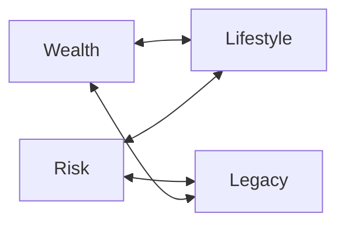

# Day 46 — Choosing the Right Angle

> **The one idea for today:** You don't pick the angle in the pitch — you picked it in the Fact-Find. If the angle feels wrong, go back and re-listen.

By the time you close today you'll diagnose the right primary angle from Fact-Find signals (questions they ask, language they use, life stage), use the life-stage × DISC matrix to pre-pick angles before the pitch meeting, and switch angles mid-pitch when you realise you misread the prospect — without losing the meeting.

---

## Where angle-matching actually happens

The angle is not chosen *during* the pitch. It's chosen *during the Fact-Find* — based on what the prospect told you about what matters.

If you walk out of a Fact-Find thinking *"I'm not sure which angle fits"*, you didn't listen hard enough. The prospect told you. You didn't capture.

The work of today is two things:
1. Knowing what signals to listen for during Fact-Find
2. Knowing how to pre-map angles before the meeting based on life stage and DISC

Both shift the angle decision from a moment of improvisation to a deliberate diagnostic.

---

## The Fact-Find signals — what to listen for

Each angle broadcasts itself through specific language. Train your ear to catch these:

### Wealth signals
- *"What's the expected return?"*
- *"How does this compare to [benchmark]?"*
- *"I'm looking to grow my portfolio."*
- *"I've been putting money in [index fund, FD, crypto]."*
- They mention specific return rates, percentages, compounding
- They have clear surplus income they're deploying

### Risk signals
- *"I want peace of mind."*
- *"What if something happens to me?"*
- *"My dad had a stroke / my aunt got cancer…"*
- *"I can't afford to be without coverage."*
- They describe a specific family member's health event
- They have dependants and carry the income

### Legacy signals
- *"When I'm gone…"*
- *"I want to make sure my kids are okay."*
- *"I've built this up — I don't want it lost."*
- *"My estate is getting complicated."*
- They talk about kids / grandkids unprompted
- They're past 45–50 with stable assets

### Lifestyle signals
- *"I want to [specific experience / goal]."*
- *"I've always wanted to [X]."*
- *"I work to live, not live to work."*
- *"Money's for enjoying life."*
- They mention a specific dream, trip, or goal
- They care more about what the money *enables* than what it *is*

**The listening discipline:** on your iPad or notebook, keep a 4-column tally — W / R / L / LS — and put a check next to each one every time the prospect drops a signal. By end of Fact-Find, whichever column has the most checks is likely your primary angle.

---

## The life-stage × DISC matrix (pre-pitch map)

If you have life-stage info + DISC profile before the Fact-Find, you can *pre-pick* probable angles. You'll still validate in the meeting, but the pre-map saves 30 minutes of open-ended probing.

| Life stage | D | I | S | C |
|---|---|---|---|---|
| **Young professional (22-30)** | Wealth | Lifestyle | Risk | Wealth |
| **Newly married / BTO stage** | Lifestyle | Lifestyle | Risk | Risk |
| **New parent (30-40)** | Risk | Risk | Risk | Risk |
| **Mid-career (35-50)** | Wealth | Lifestyle | Risk | Wealth |
| **Pre-retirement (50+)** | Legacy | Lifestyle | Legacy | Legacy |
| **HNW / business owner** | Wealth | Wealth | Legacy | Legacy |
| **Retiree** | Legacy | Lifestyle | Legacy | Risk |

Not universal, but directionally correct. Patterns that hold:

- **New parents default to Risk** regardless of profile — the kid overrides everything
- **Pre-retirees default to Legacy or Lifestyle** — the accumulation phase is behind them
- **C profiles lean Wealth or Legacy** — analytical thinkers prefer quantifiable frames
- **I profiles lean Lifestyle** — they buy on feel and experience

**Use the matrix as a hypothesis**, not a rule. Validate with actual Fact-Find signals.

---

## Secondary angle — what to tail with

After you've identified the primary, the secondary is usually the closest compatible angle. Compatibility pattern:

- **Wealth ↔ Lifestyle** — accumulation that funds specific experiences
- **Risk ↔ Legacy** — protection today that passes on tomorrow
- **Wealth ↔ Legacy** — accumulation that passes to heirs
- **Risk ↔ Lifestyle** — protection that preserves the lifestyle you've built

**The mismatch to avoid:** leading with Wealth and tailing with Risk (or vice-versa). These are opposing motivations — *grow the pile* vs *protect the pile*. Switching between them mid-pitch feels contradictory, as though you haven't decided what the pitch is about. Keep the primary and secondary in the same half (accumulation / protection).

---

## Switching angles mid-pitch

Sometimes you start pitching the wrong angle and realise it halfway. Signs:

- Prospect's energy dropped 5 minutes in
- They're asking questions from a completely different angle (*"but what happens if…"*)
- They seem polite but disengaged
- They're hedging rather than engaging

**The rescue:** stop pitching, ask a clarifying question, switch.

> *"Let me pause a second — I want to make sure I'm pitching this the right way. When you think about this plan in your life — is the main thing it's doing for you [angle A] or more about [angle B]?"*

Once they answer, restart the pitch from the right angle. Losing 3 minutes to an angle switch is fine. Losing 20 minutes to the wrong angle is not.

**Don't pretend the switch didn't happen.** Prospects respect the honesty — *"I was pitching one frame, you're showing me a different frame is more relevant, let me adjust."* That's advisor-thinking, not pitch-reciting.

---

## The danger of over-indexing on one angle

Some FCs become obsessed with one angle — usually the one that matches their own motivator.

- A Wealth-oriented FC (young C profile, high saver) pitches every prospect on compounding math
- A Risk-oriented FC (someone who had a family CI event) pitches every prospect on worst-case protection

Both miss most prospects. The discipline isn't choosing a favourite angle — it's *listening to which angle the prospect needs* and flexing.

**Self-check:** look at your last 5 pitches. Did you pitch more than 3 of them with the same angle? If yes, you're over-indexing on your own motivator, not the prospect's.

---

## Double-check before you pitch

Before you finalise your pitch construction, run this check:

1. **What primary angle am I pitching?** (Wealth / Risk / Legacy / Lifestyle)
2. **What 2+ specific Fact-Find signals support this angle?** (quote them)
3. **What secondary angle am I tailing with?** (must be compatible, not opposite)
4. **What hot-button callback am I using?** (tied to the primary angle)
5. **What profile-matched close am I using?** (D/I/S/C close from Day 38)

If all 5 answer cleanly, the pitch is built. If any answer is vague, go back to the Fact-Find data before pitching.

---

## Quiz

**Q1. The angle decision is made:**
- A) In the middle of the pitch, based on how the prospect's responding
- B) During the Fact-Find, based on signals the prospect gave you ✓
- C) In the pre-pitch planning, based on the product you want to sell
- D) Based on your own preferred angle

**Why:** The Fact-Find is where the prospect told you what matters. If you walk out unsure which angle fits, you didn't listen hard enough. Picking the angle during the pitch is improvisation — it produces generic pitches because you're not working from real data. The W/R/L/LS signal tally during the Fact-Find is the diagnostic tool that makes the angle choice deterministic, not vibes-based.

**Q2. Primary angle *Wealth* is most naturally paired with which secondary?**
- A) Risk
- B) Lifestyle ✓
- C) Opposite — pick whichever
- D) Doesn't matter

**Why:** Wealth and Lifestyle are both *accumulation-side* motivators — grow the pile, use the pile. They reinforce each other without contradiction. Wealth and Risk are *opposite-side* motivators (growth vs protection) — leading with one and tailing with the other feels contradictory. The compatibility pattern is W↔LS, R↔L, W↔L, R↔LS. Stay in the same half of the grid.

**Q3. You're 10 minutes into a Wealth-angle pitch and the prospect's energy visibly dropped. The right move is:**
- A) Push through — the data is compelling
- B) Pause, ask *"is the main thing this plan is doing for you about the returns, or more about something else?"*, and switch if they indicate a different angle ✓
- C) Apologise and reschedule
- D) Switch products

**Why:** A 10-minute angle mismatch is recoverable. A 30-minute one usually isn't — by then the prospect has mentally checked out. The honest pause + question is the rescue: it signals advisor-thinking (not pitch-reciting), gets you the real motivator directly, and lets you restart from the right angle. Prospects respect the recalibration; it actually *builds* trust rather than hurting it.

**Q4. The W/R/L/LS tally column on your notepad is used to:**
- A) Show off your system to the prospect
- B) Check off every signal the prospect gives; the column with the most checks by end of Fact-Find is likely the primary angle ✓
- C) Impress your mentor
- D) Rate the prospect

**Why:** Angle-picking from memory produces bias — you remember what confirms your hypothesis and forget what didn't. A visible tally forces objectivity. By end of a 45-min Fact-Find, if Risk has 7 checks and Wealth has 1, the primary angle is Risk regardless of what you thought going in. The tally turns angle-picking from vibes-based to data-based.

**Q5. The compatibility pattern says secondary angle should pair with primary on the same "half":**
- A) Wealth + Risk
- B) Legacy + Lifestyle
- C) Accumulation-side (Wealth ↔ Lifestyle) or Protection-side (Risk ↔ Legacy) — same half of the grid ✓
- D) Any combination is fine

**Why:** Wealth and Lifestyle both live in the accumulation/using half (grow the pile → use the pile). Risk and Legacy both live in the protection/passing half (protect the pile → pass the pile on). Pairing within a half reinforces; pairing across halves contradicts. Wealth (grow!) + Risk (don't lose!) sends mixed signals — the prospect can't tell what the pitch is fundamentally about.

**Q6. A FC looks at their last 5 pitches and notices 4 of them used Wealth as the primary angle. The self-diagnosis should be:**
- A) Wealth is universally the best angle
- B) They're over-indexing on their own motivator rather than the prospect's — their own preference is leaking into how they read every prospect ✓
- C) All their prospects were C profiles
- D) The matrix is wrong

**Why:** Over-indexing is the most common angle-mistake for experienced FCs. A Wealth-oriented FC (often a young C-profile themselves) sees Wealth signals everywhere because they *resonate* with them — while missing Risk, Legacy, or Lifestyle signals that were equally present. The fix is auditing your own pattern: if >60% of pitches use the same angle, you're pitching from your lens, not theirs.

**Q7. The 5-point double-check before delivering a pitch includes:**
- A) Primary angle + 2+ supporting signals + secondary angle + hot-button callback + profile-matched close ✓
- B) Product, price, promotion, place, people
- C) Opening, middle, close, summary, follow-up
- D) DISC + tonality + body + volume + pace

**Why:** The 5-point check operationalises the pre-pitch work: (1) name the primary angle, (2) cite 2+ Fact-Find signals that support it, (3) name the compatible secondary, (4) specify the hot-button callback, (5) specify the profile-matched close technique. If any of the 5 is vague, the pitch isn't ready — more Fact-Find data needed. The check turns pitch construction from instinct into a repeatable diagnostic.

---

## Related

- Previous: [[day-45|Day 45 — Sales Angles: Wealth, Risk, Legacy, Lifestyle]]
- Next: [[day-47|Day 47 — Analyzing Products + Crafting the Pitch]]
- Week 8 overview: [[README|Week 8 — The Pitch]]
