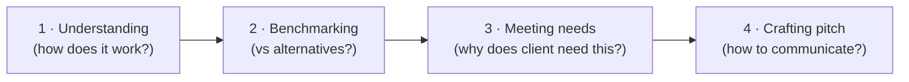

# Day 47 — Analyzing Products + Crafting the Pitch

> **The one idea for today:** A feature is what the product does. A benefit is what it does *for them*. The pitch is all benefit, zero feature-dump.

By the time you close today you'll analyse any AIA product using the 4-step method (Understanding · Benchmarking · Meeting Needs · Crafting Pitch), translate features into client-specific benefits via *"what it is → what it does → what it means for you"*, and dodge the 3 taboo pitch mistakes that kill conversions — feature-dumping, taboo phrases, and IF-language.

---

## Why product analysis matters

New FCs often pitch products they've barely examined. They read the brochure, memorise 5 features, and hope those 5 features match the prospect's needs.

They don't, most of the time.

**The alternative is structured product analysis** — understand the product *before* you try to pitch it, benchmark against alternatives, and translate features into benefits tied to the specific prospect's needs.

The framework: 4 steps, in order.

---

## Step 1 — Understanding (how does it work?)

Before you pitch any plan, know:

### Premium / coverage term
- How long do they pay?
- How long is it in force?
- What's the premium schedule — level, increasing, flexible?

### Coverage / payout features
- What's paid out, when, under what conditions?
- Anything special — multi-claim, multiplier, coupons, payout tiers?
- Exclusions — what's NOT covered?

### Yield and charges
- What's the expected return?
- What are the fees, spreads, or deductions?
- How transparent is the cost structure?

### Flexibilities
- Can they withdraw? When, how much, penalties?
- Premium holidays — how long, how many?
- Can they adjust coverage? Up, down, term changes?

**The test:** if a prospect asks you *"what happens to this plan if I'm unemployed for 6 months?"*, you should be able to answer without looking up the policy document. If you can't, you haven't finished Step 1.

---

## Step 2 — Benchmarking (vs alternatives?)

A prospect isn't choosing between *this AIA plan* and *nothing*. They're choosing between this plan and:

- Similar AIA products
- Competing products from other insurers
- Doing it themselves (DIY investing, no coverage)

**You need to know all three comparisons.**

### Similar AIA products
Which other AIA plans are near-substitutes? What do they do differently? Why would you pick this over the neighbour?

### Competing products
What are the 2–3 closest competing products from other insurers? How do they compare on premium, coverage, features, flexibilities?

### DIY alternative
What would a prospect do if they didn't buy this? Self-invest in an index fund? Rely on Medishield Life? The honest comparison matters — your job is to show why the plan beats the DIY option, not to hide that DIY exists.

**The benchmarking table** for every plan you pitch:

| | This plan | Similar AIA plan | Competitor A | Competitor B | DIY |
|---|---|---|---|---|---|
| **Premium** | | | | | |
| **Coverage** | | | | | |
| **Returns** | | | | | |
| **Flexibility** | | | | | |
| **Unique factor** | | | | | |

When a C profile asks *"how does this compare?"* you have the table. When a D profile asks *"why this one?"* you point to the unique factor line.

---

## Step 3 — Meeting needs (why does this client need this?)

This is the translation step — **features into benefits.**

A feature is *what the product does.*
A benefit is *what it does FOR THEM.*

### The translation formula

**Feature:** *"It has a 100% multiplier during claims up to age 65."*
**Benefit (generic):** *"That means higher payouts."*
**Benefit (personal, using their hot button):** *"That means if you're diagnosed with CI at 52 — the age you said your dad had his stroke — the payout to your family is $1M instead of $500K. That's the difference between your wife being able to stop working for 2 years vs being forced back to work immediately."*

Three levels:
1. **Feature** — factual description
2. **Generic benefit** — what it does in general
3. **Personal benefit** — what it does for *this specific prospect* given their hot buttons

The new-FC habit is to stop at level 1 (feature dump). The journeyman habit is level 2 (generic benefits). **The Week-8 work is to always land at level 3.**

### Translation practice

Take any feature. Run it through *"which means… which means for you…"*

| Feature | Which means… | Which means for you… |
|---|---|---|
| 20-year level term | Premium never increases for 20 years | Your monthly budget stays predictable even if your health changes |
| Waiver of premium on TPD | If you're permanently disabled, future premiums are waived | You don't lose the coverage you paid for when you most need it — when you can't work |
| 3x multiplier for early-stage CI | Early-stage CI pays triple the base amount | A mild stroke or early-stage cancer that keeps you working gets fully covered, not just the end-stage scenarios |

**The third column is the pitch language.** Memorise the translation for your top 5 products' top 5 features. That's 25 translations to know cold by Month 2.

---

## Step 4 — Crafting the pitch (how to communicate effectively?)

Four discipline rules for the pitch itself:

### Rule 1 — Visualise having the solution
Instead of *"IF you get this…"*, say *"WHEN you get this…"*

- Weak: *"If you took up this plan, in 10 years you'd have $200K."*
- Strong: *"In 10 years, when we've had this plan running, you'll have $200K sitting there. Let's talk about what that does for you."*

*"When"* language creates the mental image of ownership. *"If"* leaves the prospect mentally on the fence.

### Rule 2 — Always refer back to what matters to their heart
The hot-button callback (Day 40) is how you earn the right to suggest a product. Every product recommendation should connect back to something they already said they care about.

- Weak: *"This plan has excellent critical illness coverage."*
- Strong: *"Remember when you told me about your dad? This plan handles the exact scenario you were describing — the stretch between the event and recovery."*

### Rule 3 — Vividly describe the life the solution enables
Paint the future in detail. Not abstract. *Specific*.

- Weak: *"You'll have a comfortable retirement."*
- Strong: *"You'll be 62, you and Ruth, taking the 3-month Europe trip you've been putting off for 5 years, knowing the monthly payouts from this plan cover everything."*
- **Strongest (with CPF math anchor):** *"At 65, your CPF LIFE pays $1,600. This plan adds another $2,200 — you and Ruth land at $3,800/mo guaranteed, $4,500 once we layer in the SRS drawdown between 62 and 65. That's the lifestyle you mapped out in the Fact-Find. Specifically — that's the Europe trip in year 1, the Tokyo trip in year 3, the helping-Sarah-with-the-deposit moment in year 5, and the buffer for the medical contingency throughout."*

The third version anchors the lifestyle to specific CPF math (so it's not vague "comfortable") AND to specific moments the prospect surfaced in Fact-Find (so it's not a generic Europe trip — it's *their* Europe trip). Specific math + specific personal callbacks = the pitch that lands hardest. Use this version whenever the prospect is 50+ and their CPF position is on the table.

### Rule 4 — Avoid taboo phrases
Specific phrases to never say:

- *"I'm not trying to sell you anything"* (triggers the pushy filter — Day 9)
- *"Trust me"* (begging for trust is the fastest way to lose it)
- *"You should buy this"* (lecturing — use questions instead, per Day 43)
- *"If I may be honest…"* (suggests you haven't been)
- *"Everyone needs this"* (generic — specific is the whole point)

---

## The "approach each customer" principle

The orientation that shapes all four steps:

> **Approach each customer with the idea of helping them solve a problem or achieve a goal. Not selling a product.**

If your mental frame going into the pitch is *"I need to sell this plan,"* the prospect feels it — the energy is extractive. If your frame is *"I'm showing this prospect how to solve [specific problem] they already surfaced,"* the pitch flows as help.

Same product. Completely different received experience.

**The check before every pitch:** what problem is this prospect trying to solve, and how exactly does this plan solve it? If you can't answer in one sentence, you haven't done Steps 2 and 3 yet.

---

## Concept presentations — tools over brochures

For most pitches, a concept illustration beats the product brochure:

- **Cashflow diagram** showing premium in, coverage out
- **Side-by-side scenarios** — with vs without the plan
- **Timeline visualisation** — key moments across 20–30 years
- **One-page summary** with the 3 most important numbers

A prospect who's shown a 40-page brochure mostly glazes over. A prospect shown a single concept diagram that maps to their situation engages with the diagram.

Build your concept-presentation library over time. For each of your top 3 plans, have 2–3 concept visuals ready. These are the pitch tools that produce actual decisions.

---

## Team operations — provision the AIA product presenters + core decks

The 4-step method above teaches *how* to analyse any product. To actually run it on our specific products, you need login access to the team's illustrator tools and the 4 core decks.

### Product presenters (one pass each)
1. [APA — Long-Term Investment Illustrator](https://present.themoneybees.co/long-term-investment-illustrator)
2. [PLP — Hybrid Investment Plan](https://present.themoneybees.co/hybrid-investment-plan)
3. [HSG — HealthShield Gold Max Illustrator](https://present.themoneybees.co/healthshield-gold-max-illustrator)
4. [PWV — 5-Year Investing Plan](https://present.themoneybees.co/5-year-investing-plan/premium) · [CPF LIFE Estimator](https://present.themoneybees.co/cpf-life-estimator) · [Retirement Funding Calculator](https://present.themoneybees.co/retirement-funding-calculator)
5. [Total Wealth Concept](https://present.themoneybees.co/total-wealth-concept/twfps)

**Core product set to know cold:** APA, PLP, PWV, HSG, PA, GPP, UCC, SFT.

### Core decks to access and master
1. [Master Zoom Copy](https://docs.google.com/presentation/d/19J7VoxCXoEhQR6PZr5g9NozK22XDgyeV/edit)
2. [Retirement Planning Deck](https://docs.google.com/presentation/d/1zJBkSwfQlWoeus1-GqG2GD9SFh5qCToG/edit)
3. [Basic Medical Insurance — HSG/PA](https://docs.google.com/presentation/d/1t2d9qon3RoK6GWbK_r54-TvIGlFLYCCX/edit)
4. [Warm Market Deck](https://docs.google.com/presentation/d/1AqdqDC3SsbFAZmVR5ebS00c01Hcp_hll/edit)

### Policy summary workflow
1. Ask Aira to create a policy-summary template in your [Policy Summaries GC](https://nsgukkz32942.sg.larksuite.com/wiki/Ngepw1tzGi79u4kEEUQlVHwagwg).
2. Learn from [these tutorials](https://nsgukkz32942.sg.larksuite.com/wiki/SyDgwo8z1iPMgukezzolxHZ2gOP).
3. Ask a warm contact for their policy docs, draft a summary, send to the onboarding GC for review + portfolio strategy.

### Extra product-learning channels
- [@productsenseibot on Telegram](https://t.me/productsenseibot) for deep dives on any plan
- [Product sales classroom on Skool](https://www.skool.com/finternship/classroom/7896da20)

Full walkthrough: [[../_source-articles/onboarding-steps-first-30-days|Onboarding Steps — First 30 Days]] §4a.

---

## Quiz

**Q1. The 4-step product analysis method runs:**
- A) Pitch → Question → Close → Follow-up
- B) Understanding → Benchmarking → Meeting Needs → Crafting Pitch ✓
- C) Demo → Discuss → Decide → Document
- D) Open → Explore → Explain → Close

**Why:** Understanding comes first because you can't pitch what you don't know. Benchmarking because prospects compare whether you help or not — better to supply the comparison. Meeting Needs is the translation from features to benefits. Crafting Pitch is the delivery layer. Skipping any step produces weak pitches — skip Understanding and you can't answer questions; skip Benchmarking and you lose C profiles; skip Meeting Needs and you feature-dump; skip Crafting and the right content delivers poorly.

**Q2. The translation from *feature* to *personal benefit* goes through how many levels?**
- A) 1 — just state the feature
- B) 2 — feature → generic benefit
- C) 3 — feature → generic benefit → personal benefit tied to their hot button ✓
- D) 4 — feature → benefit → proof → close

**Why:** Level 1 (feature-dump) is the new-FC default. Level 2 (generic benefits) is journeyman. Level 3 (personal benefit tied to their specific hot button) is the Week-8 discipline. *"3x multiplier for early-stage CI"* → *"triples the payout for early-stage CI"* → *"a mild stroke at 52, like your dad had, pays out $1M instead of $500K — the difference between Ruth stopping work for 2 years and her being forced back immediately"*. The third level is where closes actually happen.

**Q3. Which of these is NOT a pitch discipline rule?**
- A) Visualise having the solution — use *"when"* not *"if"*
- B) Always refer back to what matters to their heart
- C) Vividly describe the life the solution enables
- D) Promise specific returns as guaranteed ✓

**Why:** A, B, and C are the three core pitch-crafting rules. D is a compliance violation and a trust-burner — never promise specific returns as guaranteed unless they actually are (most plans have guaranteed + non-guaranteed portions, and you must distinguish them). Overpromising returns is one of the fastest ways to damage both your relationship with the client and your licence.

**Q4. The 4-step product analysis (Understanding → Benchmarking → Meeting Needs → Crafting Pitch) exists because:**
- A) It's the compliance-required order
- B) Skipping any step produces weak pitches — skip Understanding and you can't answer questions; skip Benchmarking and you lose C profiles; skip Meeting Needs and you feature-dump; skip Crafting and the right content delivers poorly ✓
- C) It's what competitors do
- D) It's faster than the alternative

**Why:** Each step solves a different failure mode. Understanding (know the product cold) prevents being caught by edge-case questions. Benchmarking (vs alternatives) pre-empts the "I want to compare" C-profile reflex. Meeting Needs (translate features to personal benefits) is where the pitch actually lands. Crafting (delivery rules) is where the message converts to commitment. Any step skipped leaks conversion somewhere downstream.

**Q5. Benchmarking a plan should include:**
- A) Only your own products
- B) Similar AIA products + 2–3 competing products from other insurers + the DIY alternative (self-invest / Medishield Life only) ✓
- C) Only competitors
- D) Only the flagship plan

**Why:** Prospects choose between *"this plan"* and the full set of alternatives — including the option to do nothing or self-invest. A benchmark that only compares AIA products hides competitive weaknesses; a benchmark that ignores DIY skips the cheapest alternative. Real benchmarking builds 5 columns: this plan, similar AIA, Competitor A, Competitor B, DIY. That's the table that survives a C-profile's scrutiny.

**Q6. The "which means… which means for you…" translation formula moves from:**
- A) Features → features → features
- B) Feature → generic benefit → personal benefit tied to the prospect's hot button ✓
- C) Price → value → close
- D) Pitch → objection → close

**Why:** Level 1 (feature-dump: *"100% multiplier during claims until age 65"*) is the new-FC default — a fact with no application. Level 2 (generic: *"means higher payouts"*) is journeyman. Level 3 (personal: *"means your wife can stop working for 2 years instead of being forced back immediately, after a CI event at the age your dad had his stroke"*) is where closes happen. The third column is the pitch language to memorise.

**Q7. Taboo phrases to never say in a pitch include:**
- A) *"Let's think about this"*
- B) *"I'm not trying to sell you anything"*, *"trust me"*, *"you should buy this"*, *"if I may be honest…"*, *"everyone needs this"* ✓
- C) *"Thank you for your time"*
- D) *"Let me know if you have questions"*

**Why:** Each of the 5 taboo phrases triggers a specific negative reaction. *"I'm not trying to sell you"* triggers the pushy filter (only sellers say it). *"Trust me"* begs for trust, losing it. *"You should buy"* lectures rather than asks. *"If I may be honest…"* suggests you haven't been. *"Everyone needs this"* is generic when specificity is the whole point. Each costs conversion; knowing them is defensive discipline.

---

## Related

- Previous: [[day-46|Day 46 — Choosing the Right Angle]]
- Next: [[day-48|Day 48 — Practice: 1 Live Pitch on Camera]]
- Week 8 overview: [[README|Week 8 — The Pitch]]
