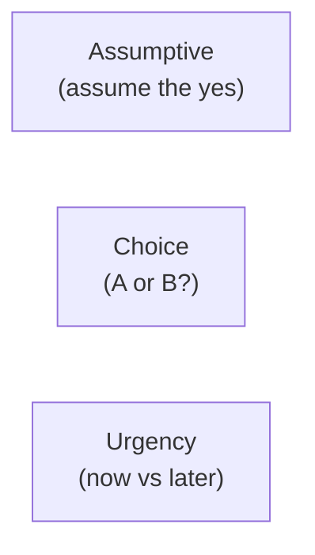

# Day 50 — Closing II: Assumptive, Choice, Urgency

> **The one idea for today:** Different prospects respond to different close structures. Know your toolkit — and which tool to reach for.

By the time you close today you'll deploy the 3 mid-tier closes — Assumptive, Choice, Urgency — with language in your own voice, match each close to the right prospect profile and moment, and recognise the failure modes of each — and when *not* to use them.

---

## The 3 mid-tier closes

Day 49 covered the Trial Close (early, repeated) and the main close (the asking-for-commitment moment). Today covers the three close *structures* you use for the main close itself:

Each creates a different psychological dynamic. Use the right one for the right moment.

---

## The Assumptive Close

**What it is:** skip the *"will you?"* beat entirely. Assume the yes has already happened and move to logistics.

### Example language:

> *"Great — I'll proceed with the application. Credit card or bank transfer for the first premium?"*

> *"Since you have two daughters, I'll set up protection for both — you wouldn't want the younger one left out. What are their dates of birth?"*

> *"If all's good I'll run the paperwork now. Would Tuesday evening work for the signing, or is Saturday morning better?"*

### Who it fits best:
- **D profiles** — they respect decisive momentum
- Prospects who gave clear forward-leaning signals throughout the pitch
- Later-stage prospects who've been through multiple meetings already

### Where it backfires:
- **S profiles** — feels like pressure; they either fake-agree and unwind within 48 hours, or visibly withdraw
- **C profiles** — feels pushy; triggers re-analysis
- Cold / early prospects who haven't yet built the pitch momentum

**The rule:** use Assumptive when the trial closes throughout the pitch were clean *and* the profile matches. Don't default to Assumptive just because it feels efficient.

---

## The Choice Close

**What it is:** present two or three clear options. The prospect chooses one. Either choice is a yes to the underlying commitment.

### Example language:

> *"We've looked at two structures — A at $400/month with $500K coverage, or B at $550/month with $750K coverage. Both fit your cashflow. Which one feels right for where you are now — A or B?"*

> *"For the premium timing — would you prefer annual (which gives the 5% discount) or monthly (easier on cashflow)?"*

> *"Would Tuesday 7pm work for the signing, or Saturday at 10am?"*

### Who it fits best:
- **S profiles** — choice gives them control without pressure
- **C profiles** — they like comparing options
- Prospects who hedge when presented with a single ask

### Where it backfires:
- **D profiles** — they often just want the best option, not a comparison exercise. Too many options slows them down.
- Prospects who are still on the fence about *whether* to commit at all — giving them a choice between A and B when they haven't yet agreed to the underlying decision feels manipulative

**The rule:** Choice Close works after the prospect has accepted the underlying commitment. It's for *how*, not *whether*.

### The 2-option vs 3-option trade-off

- **2 options** — simpler, faster, less cognitive load. Best for S profiles and faster-paced meetings.
- **3 options** — the middle option is often positioned to feel like the right choice (anchoring). Best for C profiles who like to see the range.

Never more than 3 options in a Choice Close. More = decision paralysis = deferred decision.

---

## The Urgency Close

**What it is:** introduce a time-limited element that makes now better than later.

### Example language (legitimate urgency):

> *"Underwriting rules update in two weeks — if we submit before then, you're grandfathered into the current terms. Worth moving on this now so we don't hit the new rate table."*

> *"The promotional premium ends Friday. After that, the same coverage goes up about 8%. If you were planning to move on this anyway, we can submit today."*

> *"You mentioned wanting this in place before the baby arrives. Underwriting usually takes 3–4 weeks — if we start today, we're comfortably inside that window."*

### Who it fits best:
- **D profiles** — they respect external deadlines
- Prospects who've been on the fence for weeks and need an external catalyst
- Cases where the urgency is *genuine* and relevant

### Where it backfires:
- **S profiles** — triggers the pressure reflex; they withdraw
- **C profiles** — if the urgency isn't genuine, they see through it and trust collapses
- Any prospect if the urgency is manufactured

### The ethical rule on urgency

**Never manufacture urgency.** If the deadline isn't real, don't invent one. Prospects remember when they were pressured into a decision they later regretted — and they tell their friends. Fake urgency is one of the fastest ways to damage long-term reputation.

Real urgency types that are legitimate:
- **Product changes** — premium revisions, underwriting updates, regulatory changes
- **Prospect-side timing** — upcoming life events (baby, wedding, job change) where delay has real consequences
- **Health window** — their own health situation where delay increases underwriting risk

If none of these apply, don't force urgency. Use Assumptive or Choice instead.

---

## Profile × close compatibility (expanded)

| Profile | Trial | Assumptive | Choice | Urgency | Summary / Reassurance |
|---|:---:|:---:|:---:|:---:|:---:|
| **D** | ✅ | ✅ Best | ⚠️ Too many options | ✅ Real deadline | ⚠️ Keep short |
| **I** | ✅ | ⚠️ After warm yes | ⚠️ They hedge | ⚠️ Too pushy | ✅ Story + social proof |
| **S** | ✅ | ❌ Pressure | ✅ Best — feels safe | ❌ Withdraws | ✅ Assurance-heavy |
| **C** | ✅ | ❌ Pushy | ✅ Loves options | ⚠️ Only if real | ✅ With data |

**The single most common Week-9 mistake:** defaulting to Assumptive because it feels confident. Half your prospects aren't D profiles. Assumptive is one tool, not the tool.

---

## Stacking closes within the same meeting

Advanced pattern: use different closes at different moments in the same meeting.

**Example — pitching an S-profile parent:**

1. **Trial close mid-pitch:** *"Does the 20-year term feel right, or would a shorter term work better for where you are?"* (Choice trial)
2. **Trial close post-recommendation:** *"If we did move on this — would you want coverage starting this month or next?"* (Assumptive trial)
3. **Main close:** Choice — *"We've looked at Plan A at $400/month and Plan B at $550/month. Which one fits your situation better?"*
4. **Reinforcement:** Paper-flip social proof after the yes

Four close moments. Not one. The main close is the decisive moment, but the trial closes throughout built the ladder up to it.

---

## What the close *isn't*

Two common misconceptions worth naming:

### The close isn't a trick
Closing is *asking for the decision the prospect has already been moving toward.* If you're trying to *convince* someone to say yes at the close, you missed the actual work — which was the Fact-Find (Day 43–44), hot-button activation (Day 39–41), and trial closing (Day 49) throughout.

A good close is almost boring from the outside. The prospect is ready; the close confirms it. If your closes feel high-drama, you're closing too late in the process — earn the yes earlier.

### The close isn't the end of the relationship
The close is the start of the onboarding relationship. Week 10's after-sales work picks up here. Treating the close as *"got the signature, moving on to the next prospect"* is the Year-1 mistake that kills your referral pipeline before it starts.

---

## Quiz

**Q1. The Assumptive Close fits best with:**
- A) Every prospect equally
- B) D profiles and later-stage prospects whose trial closes were clean ✓
- C) S profiles
- D) Prospects who say *"let me think"*

**Why:** Assumptive requires that the prospect has already been leaning forward — the trial closes throughout the meeting confirmed they're tracking. With D profiles (who respect decisive momentum), this works well. With S or C profiles, the Assumptive feels like pressure or pushiness and often triggers withdrawal or re-analysis. Defaulting to Assumptive is the most common Week-9 mistake.

**Q2. The ethical rule on the Urgency Close is:**
- A) Use it on every close to speed things up
- B) Never manufacture urgency — only use it when the deadline is genuine ✓
- C) Reserve it for HNW clients
- D) Avoid it entirely

**Why:** Real urgency (product changes, prospect life events, health windows) is legitimate and helpful. Manufactured urgency (*"this offer ends tomorrow"* when it doesn't) is one of the fastest ways to damage long-term reputation. Prospects notice when they were pressured into a decision they regretted, and they tell their friends. If no real urgency exists, use Assumptive or Choice instead.

**Q3. Stacking closes within the same meeting means:**
- A) Using the same close 3 times
- B) Using different close types at different moments — trial closes mid-meeting, main close at the end, reinforcement after ✓
- C) Closing with multiple products at once
- D) Having backup closes prepared

**Why:** A good pitch uses multiple close moments: 3–5 trial closes scattered throughout (warming the decision), one main close (the commitment moment), and often a reinforcement close like the paper-flip social proof afterwards. Different close structures fit different moments — Assumptive trial mid-pitch feels natural, Choice main close gives them control, social proof reinforces. Stacking the right closes at the right moments is what Week-9 craft looks like.

**Q4. The Choice Close maximum number of options is:**
- A) 2 only
- B) 3 maximum; more creates decision paralysis = deferred decision ✓
- C) 5–7 for comprehensiveness
- D) Unlimited

**Why:** 2 options (simpler, faster) fits S profiles and fast-paced meetings. 3 options (middle option often anchors) fits C profiles who like seeing the range. Beyond 3, the prospect hits decision paralysis — they defer the decision because there's too much to evaluate. The Choice Close's power comes from *constrained* choice; unconstrained choice defeats its purpose.

**Q5. Legitimate types of urgency include all of these EXCEPT:**
- A) Product changes — premium revisions, underwriting updates, regulatory changes
- B) Prospect-side timing — baby, wedding, job change
- C) Health window — their own health changing as delay increases underwriting risk
- D) *"This offer is only for people who decide today"* (manufactured) ✓

**Why:** A, B, C are real urgency categories — external facts that make now better than later. D is manufactured scarcity that's not actually tied to anything real. Prospects detect fake urgency quickly, especially C profiles, and trust collapses when they do. The ethical rule: if no real urgency exists, don't fake one; use Assumptive or Choice instead.

**Q6. The Urgency Close backfires most often on:**
- A) D profiles
- B) S profiles — urgency triggers the pressure reflex and they withdraw ✓
- C) Prospects who just closed their first case
- D) C profiles who asked for urgency

**Why:** D's respect external deadlines (a real premium change or underwriting shift aligns with how they think). S's default interpretation of urgency is pressure — the exact thing they want to avoid. Even *real* urgency for an S needs wrapping: *"there's no rush at all — but if you were planning to move, the rate change happens Friday. Want to think about it and let me know by Thursday?"* Softer framing preserves the S's sense of control.

**Q7. The "closing is almost boring from the outside" principle means:**
- A) Good closers are uncharismatic
- B) A good close is asking for the decision the prospect is already moving toward — if closes feel high-drama, you're closing too late in the process ✓
- C) The prospect should look bored
- D) Close language should be flat

**Why:** High-drama closes ("this is the moment, decide now!") signal the close is happening too late — the emotional activation and trial commitments didn't happen earlier. A well-built pitch has the prospect leaning yes by minute 50 of a 60-min pitch; the main close at minute 58 is just confirmation. If your close always feels like a showdown, you're trying to do at the close what should have been done at the Fact-Find and trial-close stages.

---

## Related

- Previous: [[day-49|Day 49 — Closing I: Trial Close + Paper-Flip]]
- Next: [[day-51|Day 51 — Closing III: Emotional vs Logical]]
- Week 9 overview: [[README|Week 9 — The Close]]
