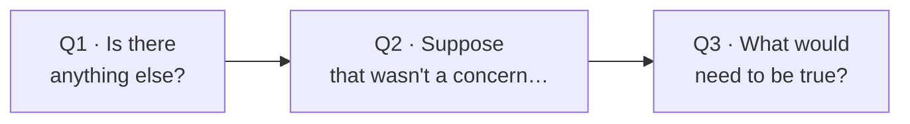

# Day 52 — The 3 Magic Questions

> **The one idea for today:** Most objections aren't what they sound like. 3 magic questions surface the real concern before you spend breath on the wrong one.

By the time you close today you'll run the 3 magic questions to surface the real objection behind surface phrasing, tell apart a hard no (accept) from a soft no (work it) from a hidden concern (surface it), and use the 3 questions as a diagnostic before responding — saving yourself from addressing the wrong objection.

---

## Why objection handling goes wrong

A prospect says *"too expensive."* The new FC launches into a value justification — *"but look at what you get for that premium…"*

But *"too expensive"* is rarely about the price. It might mean:
- **Hidden:** they can't justify it to their spouse
- **Hidden:** they don't see the need clearly yet
- **Hidden:** they're comparing to a different category (DIY investing instead of insurance)
- **Hidden:** the value hasn't landed — they don't see the coverage/premium math

If the real objection is *"I don't see the need,"* value-justifying the premium doesn't help. You have to go back and re-establish the need.

**The 3 Magic Questions are a diagnostic.** They surface the real objection before you spend energy on the wrong one.

---

## The 3 Magic Questions

### Magic Question 1 — *"Is there anything else?"*

**When:** after the prospect raises an objection.

**Phrasing:**
> *"Got it — that's a fair concern. Before I address it, let me ask — is there anything else that might be giving you pause, or is that the main thing?"*

**What it does:** surfaces hidden objections the prospect hasn't yet stated. Often the first objection raised is a *decoy* — easier to say out loud than the real concern. Asking *"anything else?"* invites them to surface the bigger one.

**Possible answers:**
- *"No, that's the main thing."* → now address that objection confidently
- *"Actually, there's also X…"* → X is usually the real objection; address that first

### Magic Question 2 — *"Suppose that wasn't a concern…"*

**When:** after they've stated their objection (and any hidden ones from Q1).

**Phrasing:**
> *"Suppose the premium wasn't a concern — if the monthly number was exactly where you wanted it — would you move forward? Or is there something else underneath?"*

**What it does:** tests whether the stated objection is the *real* one. If they say *"yes, if the premium worked, I'd move forward,"* you know the objection is legitimate — negotiate the premium. If they say *"well, even then I'd want to think about X,"* you've surfaced the deeper concern.

**Why it's powerful:** it gives the prospect permission to name the real block without losing face. They don't have to admit they were hiding something — they just respond to a hypothetical.

### Magic Question 3 — *"What would need to be true?"*

**When:** when the prospect is hedging but not giving you a concrete concern.

**Phrasing:**
> *"For you to feel confident moving forward — what would need to be true? What would I need to show you, or what would you need to see, to feel this was clearly the right decision?"*

**What it does:** forces the prospect to articulate their decision criteria. You've been guessing at what they need to see; this question makes them tell you directly.

**Possible answers:**
- *"I'd need to see the 10-year projection side by side with Competitor X"* → you now have a concrete deliverable
- *"I'd need my wife to agree"* → that's the next meeting — book it now
- *"I don't know — I just need time"* → honest signal that this is a Follow-up Close situation

---

## The diagnostic sequence

Use all 3 in order when the objection is ambiguous:

### Step 1 — Magic Q1
> *"Is there anything else?"*
- If yes → surface the deeper objection
- If no → move to Step 2

### Step 2 — Magic Q2
> *"Suppose that wasn't a concern, would you move forward?"*
- If yes → the stated objection is the real one; address it
- If no → there's a deeper issue; move to Step 3

### Step 3 — Magic Q3
> *"What would need to be true?"*
- Get their concrete decision criteria
- Now you have a path forward

Three questions, maybe 90 seconds total. You now know what the real objection is and what it would take to resolve it. Without this diagnostic, you'd have spent 10 minutes addressing the wrong concern.

---

## Hard no vs soft no vs hidden concern

After running the 3 questions, you'll land in one of three territories:

### Hard no — accept it
Signs: they're firm, specific, and the objection isn't really about price or features — it's about fit. *"I don't want insurance at all"* after a full Fact-Find is a real no.

**Move:** accept gracefully, leave the door open, follow up in 6–12 months.

> *"Completely understand. If things change in a year or two — or if you have questions down the line — happy to catch up. In the meantime, let me know if you want me to share anything useful as I come across it."*

Hard no's happen. Trying to overturn them damages the relationship. Accepting them preserves the Year-2+ possibility.

### Soft no — work it
Signs: objection is specific and addressable. Price, term length, a specific feature, timing.

**Move:** address the specific concern using ART (Day 37). Don't over-handle — one or two turns and then re-close.

### Hidden concern — surface it
Signs: their stated objection doesn't match their energy (they *seem* unsettled but the words are bland). Or Q1/Q2 revealed a deeper concern.

**Move:** the hidden concern is what you address. Spend energy there, not on the surface phrasing.

---

## The *"let me think"* special case

*"Let me think about it"* is the objection that requires all 3 magic questions almost every time — it's ambiguous by definition.

### Full sequence:

> *Prospect:* *"Let me think about it."*
>
> **You — Q1 adapted:** *"Totally fair — take the time you need. Before you do — is there anything specific giving you pause, or is it more of a general *'I want to sit with this'* feeling?"*
>
> - If *"specific"* → address the specific concern
> - If *"general"* → continue to Q2
>
> **You — Q2 adapted:** *"Let me ask differently — if the plan were exactly right, would you move forward today, or is there still something you'd want to sit with even then?"*
>
> - If *"would move forward"* → there's a specific concern. Surface it.
> - If *"still want to sit"* → continue to Q3
>
> **You — Q3 adapted:** *"Help me understand — what would need to be true a week from now that isn't true today, for you to feel ready?"*
>
> This question is where the real answer usually comes. Either they name a concrete concern (*"my spouse needs to see it"*), which becomes a concrete next step, or they reveal that the *"think"* was actually a deferral — at which point you use the Follow-up close from Day 38.

---

## The discipline of not *wanting* to skip the diagnostic

The temptation with objections is to jump straight to handling. You've prepared a good price-justification, so when they say *"too expensive,"* you want to deliver it.

**Don't.** Spend the 90 seconds on the 3 magic questions first. Half the time you'll discover the real objection is different, and your prepared response was aimed at the wrong target.

The 90 seconds of diagnostic saves 10 minutes of misdirected response — and more importantly, it saves you from the worst outcome: a prospect who said *"too expensive,"* got a price-justification response, then disengaged because *price wasn't actually the block.*

---

## Capturing what you learn

After every meeting where you used the 3 magic questions, log:

- **What the prospect initially said** (surface objection)
- **What came out of Q1** (hidden objection, if any)
- **What came out of Q2** (real vs decoy)
- **What came out of Q3** (their actual decision criteria)

Over 20 meetings, patterns emerge. You'll notice that *"too expensive"* almost always means one of 3 things for *your* specific prospect type. *"Let me think"* almost always means one of 2 things. Those patterns are the intelligence that makes you faster in future meetings.

---

## Quiz

**Q1. The 3 Magic Questions are designed to:**
- A) Handle every objection with the same script
- B) Diagnose the real objection before you spend energy on the wrong one ✓
- C) Close harder
- D) Buy time during the meeting

**Why:** Most surface-level objections (*"too expensive"*, *"let me think"*, *"I need to discuss with my spouse"*) are decoys or generic phrasing for deeper concerns. The 3 questions (Q1 anything else / Q2 suppose that wasn't / Q3 what would need to be true) surface the real block in about 90 seconds. Without the diagnostic, you address the wrong objection and lose the meeting.

**Q2. Magic Question 2 (*"Suppose that wasn't a concern, would you move forward?"*) works because:**
- A) It corners the prospect
- B) It gives the prospect permission to name the real block without losing face ✓
- C) It removes the objection entirely
- D) It forces a yes

**Why:** A prospect who's hiding a deeper concern behind a price objection (for example) often can't admit it directly — it would feel like they were being dishonest. Q2 frames the test as a *hypothetical*, which gives them a graceful way to respond. *"Well, even then I'd want to think about X"* is an easy answer to give to a *"suppose that wasn't a concern"* question but a hard answer to offer unprompted. The question unlocks honesty without forcing confession.

**Q3. A prospect firmly says *"I don't want insurance at all"* after a full Fact-Find. The right response is:**
- A) Run all 3 magic questions to surface the real objection
- B) Push back with a rebuttal
- C) Accept the hard no gracefully, leave the door open, follow up in 6–12 months ✓
- D) Offer a discount

**Why:** A firm, specific objection that's fit-related (not price or feature-related) is a hard no. Trying to overturn it damages the relationship. Accepting it gracefully preserves the Year-2+ possibility — people's circumstances change, and the advisor who respected their *no* is the one they come back to later. Running diagnostic questions on a hard no feels disrespectful; a discount offer makes the *no* feel like a negotiation tactic.

**Q4. The 3 Magic Questions in order are:**
- A) "What's the problem?" → "Why can't you decide?" → "When?"
- B) "Is there anything else?" → "Suppose that wasn't a concern, would you move forward?" → "What would need to be true?" ✓
- C) "Are you ready?" → "Are you sure?" → "Really?"
- D) "How much can you afford?" → "By when?" → "Why not today?"

**Why:** Each question does a specific job. Q1 surfaces hidden objections (decoys). Q2 tests whether the stated objection is the real one. Q3 forces the prospect to articulate decision criteria. Together they surface the real block in ~90 seconds. The order matters: anything-else first (because half of stated objections are decoys), then the suppose-test, then the criteria-ask as the final resort.

**Q5. Magic Q1 ("Is there anything else giving you pause?") matters because:**
- A) It fills time
- B) The first objection raised is often a decoy — easier to say out loud than the real concern ✓
- C) It shows empathy
- D) It's required by the framework

**Why:** Prospects often state an "easy" objection as a cover for the harder one. *"Too expensive"* might be easier to say than *"I don't actually trust you yet"* or *"my spouse will kill me if I commit to this."* Asking *"is there anything else?"* invites the real concern without accusing them of hiding. Most new FCs skip this step and address the decoy — which never closes the deal because the real block is untouched.

**Q6. If you've spent 10 minutes addressing what you thought was the real objection and the prospect still hesitates, the likely issue is:**
- A) You need to work harder at the same objection
- B) You skipped the diagnostic and addressed the wrong objection — run Magic Q2 now to test ✓
- C) The prospect is irrational
- D) The product isn't right

**Why:** 10 minutes of addressing an objection that doesn't clear is the tell that you've been aimed at the wrong target. Running Magic Q2 now (*"suppose the [stated objection] wasn't a concern, would you move forward?"*) quickly tests whether the stated objection is the real one. If they'd still hesitate, the real block is elsewhere — back up to Q1 or Q3 to surface it. Don't keep pushing on the visible objection if it's not the actual one.

**Q7. The 90-second diagnostic time investment is worth it because:**
- A) It fills meeting time
- B) 90 seconds of diagnostic saves 10+ minutes of misdirected response — and avoids the worst outcome (prospect disengages because you addressed the wrong concern) ✓
- C) It impresses the prospect
- D) It's required by the framework

**Why:** The math is simple: 90 seconds + correct target = close; 0 seconds + wrong target = 10+ min of wasted effort + failed close + prospect walking out. The temptation is to skip the diagnostic because you've prepared a good price-justification (or similar) and want to deliver it. The discipline is to diagnose first, address second — always in that order, no matter how confident you are about the objection.

---

## Related

- Previous: [[day-51|Day 51 — Closing III: Emotional vs Logical]]
- Next: [[day-53|Day 53 — Top 10 Objections + Scripts]]
- Week 9 overview: [[README|Week 9 — The Close]]
