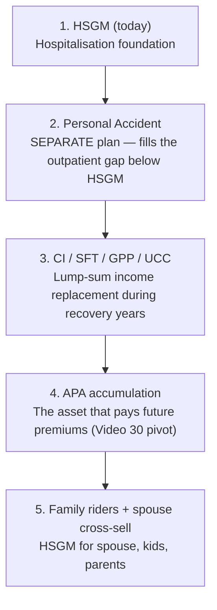

# Day 4 — Defence + Expansion: Top 5 Objections + Cross-sell

> **Today's frame:** Objections are the points where the prospect tells you which conviction they need to hear next. An FC who can deliver these five conviction stories on demand — without notes, without flinching — closes meetings that less prepared FCs lose. Then HSGM becomes the door-opener for the whole AIA stack.

This is the longest module in the track. Part 1 covers the 5 objections (the conviction-story heart). Part 2 covers cross-sell + bundling. Estimated read + drill: ~65 minutes.

---

# Part 1 — Top 5 Objections (the Conviction-Story Heart)

> **The one idea for Part 1:** Don't argue against MediShield Life or competitor IPs — reframe what the prospect is actually choosing. The pro-ration story handles "MediShield is enough." The portability + pre-existing story handles "employer covers me." The S$1M co-insurance math handles "rider is too expensive." The optionality story (A→B is automatic, B→A faces underwriting) handles "why A vs B." The underwriting-window story handles "what if I switch later."

By the end of Part 1 you should be able to recite all 5 conviction stories from memory, deploy the brochure-page-9 Tom example for Objection 3, and recognise which objection arc the prospect is on within 60 seconds of them speaking.

---

## Objection 1 — "MediShield Life is enough"

**The script:**

> *"MediShield Life is the foundation, and it's great that we all have it. But the way it's sized — for B2 and C-class wards in public hospitals — means the moment you upgrade your ward or step into a private hospital, your bill is pro-rated. A S$200,000 private hospital bill: MediShield Life pays the public-ward equivalent, you pay the rest. The remainder is what HSGM closes.*
>
> *It's also why even people who say they'll only ever go public still need at least the B Lite plan — because in a real emergency, the ambulance doesn't always ask which ward you want."*

**The conviction:**
- MediShield Life is sized for B2/C-class wards. Pro-ration on private bills wipes out the apparent payout
- "It is better to be secured and not need it than to need it and not have it"
- High medical expenses are uniquely destructive to financial security

**Sources:** Video 0, Video 3, Video 6, [Brochure p.8] (three-stack diagram), [Product Summary] (pro-ration factors)

---

## Objection 2 — "I have employer / corporate coverage"

**The script:**

> *"Corporate cover is excellent while you have it. Three things to think about.*
>
> *First, it disappears when the job disappears — and that's exactly when you might need it most: career break, retrenchment, retirement, or just a job switch.*
>
> *Second, it usually excludes pre-existing conditions, so anything that develops while you're with this employer becomes uninsurable later if you lose the cover.*
>
> *Third, the caps on corporate medical are typically well below S$2 million a year.*
>
> *HSGM is portable, lifetime, and yours regardless of where you work. The right move is to layer HSGM underneath the corporate plan now, while you're healthy and underwriting is clean."*

**The conviction:**
- Corporate cover is non-portable
- Pre-existing conditions become permanent exclusions if you wait
- HSGM as the foundation, corporate as the top-up — not the other way round

**Sources:** Video 9 (urgency framing), Video 7 (switching window for healthy clients), [Brochure p.20] (pre-existing exclusion clauses)

---

## Objection 3 — "The rider is too expensive. Why not just take the base plan?"

**The script:**

> *"Let me show you why. Without the rider, your maximum exposure on a single bill is the deductible plus 10% co-insurance.*
>
> *On a S$100,000 bill, that's S$3,500 plus S$9,650 — around S$13,150 out of pocket.*
>
> *On a S$1 million bill, the 10% co-insurance alone is roughly S$99,650.*
>
> *So the rider isn't a luxury — it's what stops a S$1 million event from becoming a S$100,000 personal bankruptcy.*
>
> *With the rider, you pay 5% capped at S$6,000 a year, full stop. For a young adult, that rider is roughly S$60 to S$80 a month for private. Less than a kopitiam breakfast a day for a hard ceiling on lifetime medical risk."*

**The conviction:**
- Without rider: small bills are irritating (deductible kills you), large bills are devastating (10% co-insurance is uncapped)
- With rider: cap converts unbounded medical risk into a known, budgetable annual maximum
- The cap requires preferred provider OR pre-auth OR A&E referral — without one, the 5% has no cap (always disclose)

**Sources:** Video 4, Video 5 (90-cent cheque story), Video 6 (S$1M worked example), Video 14 (clean comparison table), [Brochure p.9] (Tom S$200K worked example), [Brochure p.16] (cap conditions)

---

## Objection 4 — "Why pay for ward-class A when B is so much cheaper?"

**The script:**

> *"Three reasons.*
>
> *First, waiting time. As a young adult, your priority for a public bed is low — three, six, even seven hours waiting just to be admitted.*
>
> *Second, control. With a private hospital you choose your doctor, you get a private room, your follow-up appointments come faster.*
>
> *Third — and this is the one most people miss — flexibility. If you start with Plan A and later decide it's too expensive, you can always downgrade to B with no fresh underwriting. But if you start with B and later want to upgrade to A, you face full underwriting again. By then, if anything has shown up on a medical report, you may not qualify.*
>
> *So Plan A now buys you the option to stay or to step down. Plan B now closes the upgrade door."*

**The conviction:**
- Optionality has value: A → B is automatic, B → A faces underwriting
- Public-ward priority is age-banded against young adults
- The cash-portion gap between A and B at young ages is small; the gap at older ages is real, and that's when the option to downgrade matters most

**Sources:** Video 4 (public-ward 7-hour wait, downgrade-anytime logic), Video 7 (upsell-A-by-flexibility argument in full), Video 15 (age-band cost realism), [Brochure p.2] (three-tier ward entitlements)

---

## Objection 5 — "What if I switch jobs / change my mind / want to leave AIA later?"

**The script:**

> *"HSGM is portable — it's yours regardless of employer. If you ever want to switch insurers, the back-end of the IP system handles it: when your new policy is approved, the old one auto-terminates. You don't have to call customer service.*
>
> *The catch is medical underwriting. If you've made claims or developed any condition between now and then, the new insurer can decline you, load your premium, or exclude the condition. So switching is easy when you're healthy and hard when you're not — which is exactly why the buy-when-healthy logic matters.*
>
> *AIA also has the strongest claims rating in the SMA Integrated Shield Plan Providers' Ranking Survey, so the case for switching out is usually weak in the first place — AIA was rated highest overall by experts in the SMA 2022 ranking (published June 2023)."*

**The conviction:**
- Portability is structural to the IP system, not a sales claim
- Switching is easy in the healthy-and-no-claims state, hard in any other state
- AIA #1 SMA ranking removes most prospects' rationale for switching out

**Sources:** Video 7 (switching mechanics on the back-end), Video 19 (SMA survey + claims-based pricing trap at competitors), [Brochure p.1] (SMA 2022 #1 overall rating citation)

---

## The single line that handles 80% of pushback

When a prospect drifts back to "let me just stick with what I have":

> *"You're right that what you have today works today. The question is what works in 5 years, when you're slightly older, possibly with a condition on file, possibly without the corporate cover. Lock the foundation now, while underwriting is clean. Adjust later from a position of strength."*

Then silence. Let it sit.

---

## Drill (Part 1) — 60 minutes

1. **Recite all 5 conviction stories** out loud, in order. Time each — should be under 90 seconds.
2. **Memorise the pro-ration story** (B2/C-sized, private bill = wipeout). Recite from memory.
3. **Memorise the S$1M math** (S$3,500 + S$99,650 = S$103,150 without rider). Drill until automatic.
4. **Memorise the optionality story** (A→B free, B→A re-underwrite). Recite without notes.
5. **Memorise the SMA #1 ranking citation** (Brochure p.1).
6. **Run a roleplay.** Pair with a peer or simulate. Have them throw all 5 objections in random order. Score whether you used the script + the conviction + the closing line.
7. **Identify the objection you're weakest on.** Write the answer out by hand. Re-read tomorrow.

---

# Part 2 — Cross-sell + Bundling: What Pairs With HSGM

> **The one idea for Part 2:** HSGM closes the protection floor — everything else builds on top. The natural progression in a single relationship is HSGM → PA (outpatient gap) → CI/Term (income replacement) → APA accumulation (the asset that pays future premiums). The pivot from HSGM to APA via the lifetime-healthcare-cost frame (Video 30) is the single highest-leverage cross-sell in the AIA stack.

By the end of Part 2 you should be able to: recommend the right Cancer Care Pro / Emergency Care Pro stack per prospect, run the HSGM-to-APA pivot using the lifetime-healthcare-cost framing, recognise when to sell complementary cover instead of switching a competitor IP, and book the next cross-sell appointment cleanly.

---

## The natural HSGM bundle (default for Plan A)

| Component | Role |
|---|---|
| **HSG Max A** | Private-hospital hospitalisation foundation |
| **AIA Max VitalHealth Pro A** (rider) | 5% co-pay capped at S$6,000/yr — converts unbounded risk to known cap |
| **Cancer Care Pro** (add-on) | Outpatient cancer drug ceilings (16× MSHL CDL, S$200K non-CDL) |

This trio is the conviction stack for any prospect with family history of cancer (almost everyone, statistically).

## Emergency Care Pro (the second add-on layer)

For prospects who travel, drive, or have school-age children:

| Benefit | Limit |
|---|---|
| Emergency medical evacuation & repatriation | S$50,000 per policy year |
| Ambulance service | S$250 per hospitalisation/emergency outpatient |
| Emergency post-accident outpatient | S$2,000 per policy year (less 5% co-pay) |
| HFMD / dengue outpatient | S$300 per policy year (less 5% co-pay) |
| International medical assistance | (per policy schedule) |

[Brochure p.17]

The trigger questions in fact-find:
- *"Do you travel overseas often?"* (evacuation/repatriation matters)
- *"Do you drive? Have a motorcycle? Active sports?"* (ambulance + post-accident outpatient)
- *"Kids in school?"* (HFMD/dengue is real)

## The HSGM-to-APA pivot (Video 30 — the highest-leverage cross-sell)

Lifetime healthcare costs project to roughly **S$300,000+**; annual costs in retirement can exceed **S$26,000**. Reframe HSGM not as an expense but as a known liability that a dividend-paying retirement plan can fund for life.

The script:

> *"Lifetime healthcare costs project to about S$300,000. Why not transform this from a cost into an asset? Use a dividend-paying retirement plan — APA — to throw off the income that pays your hospital plan for life. We're solving today's protection AND tomorrow's premium-paying capacity in one architecture."*

This is the bridge into a follow-up APA appointment. Don't bundle in the HSGM close. Two appointments.

## HSGM as door-opener — the cross-sell ladder



(Wait — mermaid won't render in some renderers. Use ASCII fallback:)

```
1. HSGM (today)              → Hospitalisation foundation
        ↓
2. Personal Accident         → SEPARATE plan — fills the outpatient gap
        ↓
3. CI / SFT / GPP / UCC      → Lump-sum income replacement during recovery
        ↓
4. APA accumulation          → The asset that pays future premiums (Video 30)
        ↓
5. Spouse / family HSGM      → Lock spouse's premium at current age
```

Each step is a different conversation. Don't try to close all five today.

## When to switch a prospect from a competitor IP

The rule:

> *"If you're healthy and you don't have major claims, switching is straightforward. If you have made claims or there's a condition on file, switching may close doors that are still open at your current insurer."*

Decision tree:

| Prospect state | Recommendation |
|---|---|
| Healthy, no claims | Switch to AIA HSGM (back-end auto-terminates old IP) |
| Has condition on file or made claims | **Don't switch.** Leave existing IP. Sell complementary cover (CI / accident / life) instead |
| Unsure | Ask for medical history. If anything material — leave existing IP |

Switching a claims-history prospect risks losing them entirely to a fresh-underwriting decline. That's an FC discipline failure, not a sales win.

## AIA Vitality coin booster (mention if relevant)

| Booster | Value |
|---|---|
| Engagement booster | 3% of first gross annualised premium |
| Annual insurance booster | Up to 10% of gross annualised premium based on Vitality status at renewal |

[Brochure p.7]

For health-conscious prospects, this is a real reason to enrol Vitality at delivery.

## Cross-sell discipline rules

1. **Don't bundle PA / CI / APA into the HSGM close.** Each is a separate appointment.
2. **Always include Cancer Care Pro by default on Plan A** unless prospect actively opts out.
3. **Always check for spouse / kids / ageing parents** during fact-find — multi-policy quotes are the highest-conversion cross-sell.
4. **Don't switch a competitor IP unless the prospect is healthy + no claims.** Discipline > short-term commission.
5. **Use Video 30's healthcare-cost framing** to bridge HSGM → APA — this is the highest-leverage long-term cross-sell.

---

## Drill (Part 2)

1. **Memorise the natural HSGM bundle** (Plan A + Pro A + Cancer Care Pro). Recite without looking.
2. **Practise the Cancer Care Pro pitch** for a hypothetical cancer-family-history prospect. Time it — under 60 seconds.
3. **Memorise the HSGM-to-APA pivot script** (lifetime healthcare cost ~S$300K).
4. **Practise the switching decision tree.** Pick 3 hypothetical prospect profiles — for each, decide switch or layer.
5. **Memorise the AIA Vitality coin boosters** (3% engagement / up to 10% renewal).

---

## What's coming next

Day 5: compliance + close. Part 1 — the four mandatory MAS disclosures (premiums-not-guaranteed, one-IP-per-MediSave, switching disclosure, value-added-services-not-contractual). Part 2 — the two-option close ("private or public?"), IPOS workflow, breakfast-comparison framing, delivery, post-close service rhythm.

---

## Quiz
1. **The conviction story for "MediShield Life is enough" is anchored on which concept?**
- A) Lifetime coverage
- B) Pro-ration — MediShield Life is sized for B2/C-class, so a private bill is pro-rated and the prospect pays the rest ✓
- C) Smoker loading
- D) Cash-only premiums

**Why:** MediShield Life is sized for B2 and C-class. A private-hospital bill is pro-rated to ~35% before MediShield Life pays anything; HSGM A removes pro-ration (factor 100%).

2. **The strongest reason to layer HSGM under existing employer/corporate medical is:**
- A) The corporate plan has higher premiums
- B) Corporate cover disappears when the job disappears, and pre-existing conditions developed under it become uninsurable later ✓
- C) HSGM is required by MAS
- D) Corporate plans never cover surgery

**Why:** Corporate cover is non-portable. Anything that develops while you're with this employer becomes a pre-existing exclusion if you lose the cover and try to buy fresh.

3. **The "rider is too expensive" objection is best answered with which math?**
- A) "It's only S$10/month, you can afford it."
- B) "Without rider, on a S$1M bill, the 10% co-insurance alone is ~S$99,650 — total OOP ~S$103,150. The rider caps lifetime medical risk at S$6,000/year." ✓
- C) "Riders are mandatory under MediShield Life."
- D) "The rider is cheaper than CI, so it's a bargain."

**Why:** The S$1M math is the conviction — rider converts unbounded medical risk into a known annual maximum (S$6,000 cap). It is not a luxury; it is what stops a S$1M event from becoming a personal bankruptcy.

4. **The optionality conviction (why Plan A now over Plan B) hinges on:**
- A) Plan A premiums never rise
- B) Plan A is the only one with Cancer Care Pro
- C) A → B is automatic with no fresh underwriting; B → A requires full underwriting and may be declined ✓
- D) Plan B excludes all private hospitals

**Why:** Downgrade A→B is free; upgrade B→A faces fresh underwriting. Plan A now buys the option to stay or step down. Plan B now closes the upgrade door.

5. **Cancer Care Pro CDL drug coverage is set at:**
- A) 5x MSHL monthly limit per primary cancer
- B) 10x MSHL monthly limit per primary cancer
- C) 16x MSHL monthly limit per primary cancer ✓
- D) Unlimited

**Why:** CDL drugs at 16x MediShield Life monthly limit per primary cancer, less 10% co-insurance [Brochure p.4 + p.17].

6. **Cancer Care Pro non-CDL drug ceiling per policy year is:**
- A) S$50,000
- B) S$100,000
- C) S$200,000 ✓
- D) S$500,000

**Why:** S$200,000 per policy year for non-CDL drugs (Classes A, B, C, D1–D3, E1–E3), less 10% co-insurance.

7. **The Emergency Care Pro evacuation/repatriation benefit is:**
- A) S$10,000 per policy year
- B) S$25,000 per policy year
- C) S$50,000 per policy year ✓
- D) S$100,000 per policy year

**Why:** Emergency medical evacuation & repatriation is S$50,000 per policy year — the trigger questions are travel, driving, active sports, school-age kids [Brochure p.17].

8. **A competitor-IP prospect tells you they have a chronic condition on file. What is the correct switching discipline?**
- A) Switch them anyway — AIA's product is better
- B) Switch only the rider, leave the base
- C) Don't switch — leave the existing IP and sell complementary cover (CI / accident / life) instead ✓
- D) Tell them to lapse the old policy first, then apply

**Why:** Switching a claims-history or condition-on-file prospect risks a fresh-underwriting decline. Discipline > short-term commission. Sell complementary cover.

9. **The HSGM-to-APA pivot uses which lifetime-cost number to reframe HSGM as a known liability?**
- A) ~S$50,000
- B) ~S$100,000
- C) ~S$300,000+ (annual retirement healthcare costs can exceed ~S$26,000) ✓
- D) ~S$1,000,000

**Why:** Lifetime healthcare costs project to ~S$300,000+; annual retirement healthcare can exceed S$26,000. The frame: use APA dividends to throw off income that pays the hospital plan for life.

10. **Scenario: A 35-year-old prospect with a 2-year-old child, a wife, and ageing parents asks "what should I get first?" Following cross-sell discipline, which sequence is correct?**
- A) Bundle HSGM + PA + CI + APA + spouse all today
- B) Close HSGM today; book separate appointments for PA, CI/term, APA, and spouse — each is a different conversation ✓
- C) Skip HSGM and go straight to APA accumulation
- D) Sell only the rider, leave the base for next year

**Why:** Each step in the cross-sell ladder is a separate appointment. Don't bundle PA / CI / APA into the HSGM close — that fragments the decision and overwhelms the prospect.
